# VEXPLOR AAS Studio 사용법

설비의 AASX 파일을 **만들고 · 고치고 · 검사하고 · 제출**하는 도구입니다. AASX Package Explorer가
해 주지 못하는 것 — **KOSMO 규칙 검사와 자동 교정** — 이 이 도구의 존재 이유이고, 거기에
공정·회사 단위의 구성 트리, OPC UA 현장 값 수집·내주기, 가이던스 문서용 자료 뽑기가 붙어 있습니다.

> 이 문서는 **쓰는 사람**을 위한 것입니다. 설치는 [설치.md](설치.md), 검사하는 규칙은 [규칙_목록.md](규칙_목록.md)에 있습니다.
> 화면 갈무리는 2026-09-11 판(v1.0.0)입니다.
>
> 📊 **발표·교육용 PPT**: `python scripts/make-manual-pptx.py` → `out/VEXPLOR_AAS_Studio_사용법.pptx` (이 문서와 같은 순서, 갈무리 포함)

**전체 흐름** — 이 순서로 읽으면 설비 한 대를 처음부터 끝까지 만들 수 있습니다.

```
 ① 띄우기 → ② 새로 만들기 → ③ 값 채우기·요소 추가·첨부 → ④ 지적 확인 → ⑤ 자동 고치기
        → ⑥ 검증 결과서 → ⑦ AASX 내려받기 → (선택) 회사·공정 묶기 · 현장 값 수집
```

| 장 | 내용 |
|---|---|
| [1](#1-준비와-실행) | 준비와 실행 — 혼자 쓰기 · 사내 서버 |
| [2](#2-첫-화면) · [3](#3-화면-구성) | 첫 화면 · 화면 구성 |
| [4](#4-설비-한-대-만들기--처음부터-끝까지) | **설비 한 대 만들기 — 처음부터 끝까지** |
| [5](#5-편집-조작-모음) | 편집 조작 모음 — 우클릭 · 순서 · 이름 · 되돌리기 · 이력 |
| [6](#6-부품-구성-bom) | 부품 구성 (BoM) |
| [7](#7-회사공정-묶음-만들기) | **회사·공정 묶음 만들기** |
| [8](#8-현장-값-수집-opc-ua) | 현장 값 수집 (OPC UA) · 내주기 |
| [9](#9-파일-관리) | 파일 관리 — 목록 · 일괄 지우기 · 이어서 작업 |
| [10](#10-규칙과-검증-결과서) · [11](#11-문서용-자료) | 규칙과 결과서 · 문서용 자료 |
| [12](#12-사내에-공유하기--접근-토큰) · [13](#13-문제가-생기면) · [14](#14-알아-둘-한계) | 사내 공유 · 문제 해결 · 한계 |
| [부록](#부록-a-자주-만나는-지적과-대처) | 자주 만나는 지적 · 용어 한눈에 |

---

## 1. 준비와 실행

### 혼자 쓰기 — 개발용으로 띄우기

```bash
cd AAS_Basyx
npm install && npx tsc -b          # 처음 한 번 (Node 22 이상)

npm run dev:api                     # ① API        http://localhost:8080
npm run dev:web                     # ② 저작 화면   http://localhost:5173  (다른 창에서)
```

**API를 먼저 띄웁니다.** 브라우저에서 **http://localhost:5173** 을 엽니다.

> 🔴 이렇게 띄우면 **저장소가 메모리**라 서버를 내리면 올린 파일이 사라집니다.
> 남기려면 `AAS_DATA_DIR=out/data node apps/api/dist/server.js`처럼 폴더를 주거나(혼자 쓸 때),
> 아래 사내 서버 구성(Docker)을 쓰십시오. 어느 쪽이든 **작업 결과는 「AASX 내려받기」로 파일을 챙기는 것**이 기본입니다.

| 하고 싶은 것 | 명령 |
|---|---|
| 현장 값 수집(OPC UA)까지 켜기 | `COLLECT=on node apps/api/dist/server.js` (8장) |
| 값 내주기(OPC UA 서버)까지 켜기 | `OPCUA_SERVER=on …` (8-6절) |
| 빌드본으로 한 포트에서 | `npm run --silent build -w @aas/web` 후 `WEB_ROOT=apps/web/dist node apps/api/dist/server.js` → http://localhost:8080 |

### 사내 서버에 올리기 — Docker

한 줄로 **API·저작 화면·데이터베이스**가 함께 뜨고, 자료는 DB에 남아 껐다 켜도 그대로입니다.

```bash
cp .env.example .env               # ① 설정 파일 — POSTGRES_PASSWORD와 AAS_TOKEN을 채운다 🔴
docker compose up -d --build       # ② 띄운다 (처음 한 번은 빌드에 몇 분)
docker compose logs -f app         # ③ 기동 로그 — 인증·저장소 상태가 여기 찍힌다
```

브라우저에서 **http://서버주소:8080** (또는 `.env`의 `APP_PORT`). 화면과 API가 같은 주소를 씁니다.

| 하고 싶은 것 | 명령 |
|---|---|
| 새 판으로 올리기 | `git pull && docker compose up -d --build` — 🔴 `--build`가 빠지면 옛 화면 그대로입니다 |
| 내리기(자료는 남음) | `docker compose down` |
| 🔴 자료까지 지우기 | `docker compose down -v` — 되돌릴 수 없습니다 |
| 화면이 안 보인다 | 그 서버 PC의 Docker Desktop이 내려간 것이 대부분입니다. Docker Desktop 실행 → `docker compose up -d` |

`.env`에서 정하는 것: `POSTGRES_PASSWORD`(필수) · `AAS_TOKEN`·`AAS_READONLY_TOKEN`·`AAS_SETUP_CODE`(12장) ·
`APP_PORT` · `COLLECT`·`COLLECT_INTERVAL`·`COLLECT_RETENTION_DAYS`(8장) ·
`OPCUA_SERVER`·`OPCUA_PORT`·`OPCUA_HOST`(8-6절) ·
`AAS_ALLOW_OPEN=1`(계정·키 없이 사내 여러 명이 쓸 때). 설치 꾸러미 안내는 [설치.md](설치.md).

> 올린 뒤 브라우저로 들어가 **설정 → 첫 관리자 만들기**를 누르면 계정으로 씁니다(12장).
> 사람이 로그인을 쓰기 시작하면 **앞에 HTTPS를 두십시오**(12-3).

### 남이 준 파일 열기 (XML 형식)

`.aasx` 안이 XML이어도 열립니다. 열 때 **JSON으로 바꿔 들여오고** 그 사실을 알립니다 — 저장은 언제나 JSON입니다.
BaSyx·Package Explorer 모두 JSON을 읽습니다.

---

## 2. 첫 화면

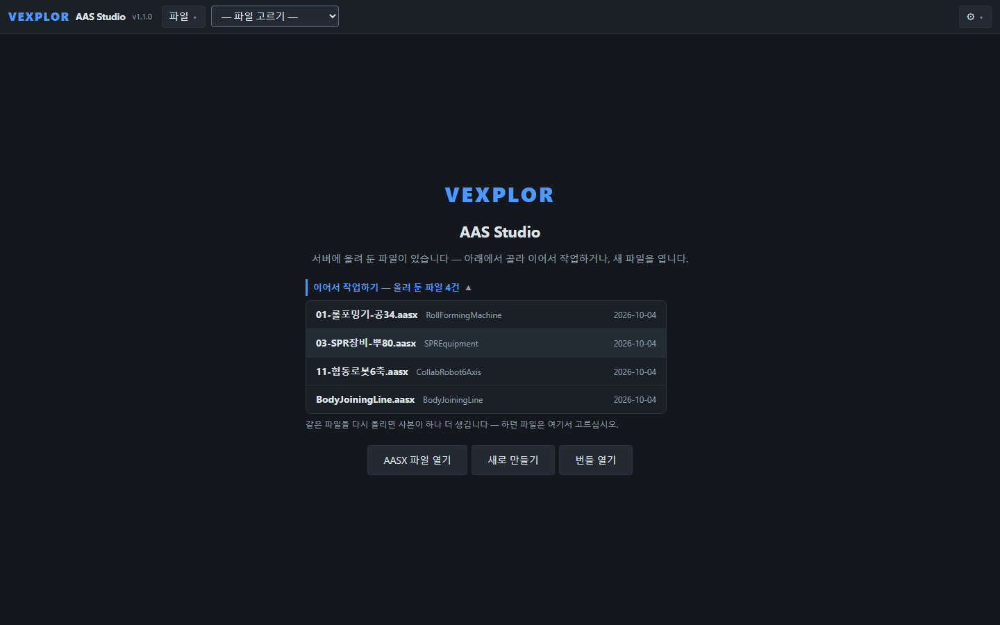

세 갈래입니다.

| 버튼 | 언제 |
|---|---|
| **「AASX 파일 열기」** | 가진 `.aasx`가 있을 때 (PC에서 고릅니다) |
| **「새로 만들기」** | 빈 것부터 시작할 때 (4장 · 7장) |
| **「번들 열기」** | 받은 레퍼런스 번들(ZIP)을 열 때 (7-7절) |
| **「견본으로 시작하기」** | AASX가 한 장도 없을 때 — 다 채운 설비 1종(`RollFormingMachine_sample`)과 공정 구성이 열립니다. 고쳐도 되는 연습용입니다 |

> 처음이라면 견본부터 여십시오. 「새로 만들기」는 **빈 서브모델 여섯 개**로 시작해, 무엇을 채우는지 아직 모를 때는 막막합니다.
> 견본을 열어 두면 4-4절의 **「다른 파일에서 가져오기」**로 견본의 명판·기술사양을 새 설비에 통째로 가져와 값만 고칠 수 있습니다.

서버에 **이미 올려 둔 파일이 있으면 「이어서 작업하기」 목록이 먼저** 보입니다. 하던 파일은 여기서 고르십시오.

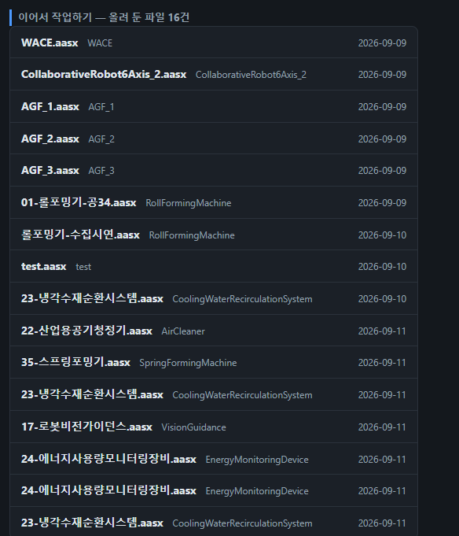

> 🔴 같은 파일을 「AASX 파일 열기」로 **또 올리면 사본이 하나 더** 생겨 목록에 같은 이름이 나란히 쌓입니다.
> PC에서 올리는 것은 처음 한 번이고, 그다음부터는 목록에서 고릅니다. 로고를 눌러 처음 화면으로 나와도
> 파일은 그대로 남아 있습니다.

---

## 3. 화면 구성

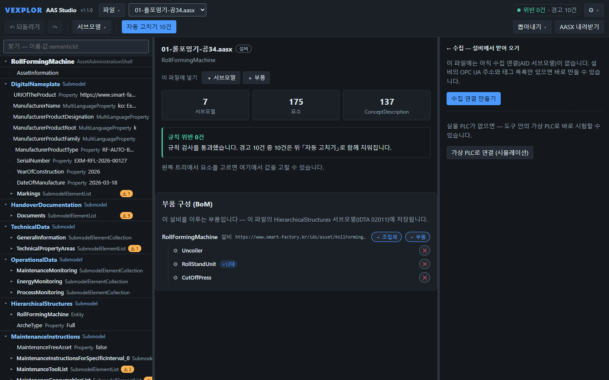

세 칸입니다. 칸 사이 손잡이를 끌어 너비를 바꿀 수 있고, **남는 폭은 가운데(작업 칸)가 씁니다.**

| 칸 | 무엇 |
|---|---|
| **왼쪽 — 트리** | 파일 안의 전부: AAS → AssetInformation · 서브모델 → 요소 · ConceptDescription(용어 정의). 종류 이름(Property · SubmodelElementList…)은 **규격 원문 그대로** — KOSMO 지적문·Package Explorer와 같은 글자라 대조가 됩니다. `✕ 3`·`⚠ 2` 배지는 그 아래에 있는 위반·경고 수 |
| **가운데 — 요약 / 편집** | 아무것도 고르지 않으면 파일 요약(숫자·판정)과 구성 패널. 요소를 고르면 그 속성과 편집칸 |
| **오른쪽 — 수집** | OPC UA 연결 상태와 태그별 현재값(8장). 수집을 안 쓰면 비워 두면 됩니다 |

### 헤더는 두 줄

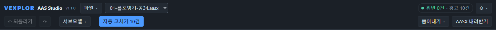

늘 쓰는 것만 밖에 두고, 가끔 쓰는 것은 **묶음 메뉴(▾)** 안에 넣었습니다.

| 줄 | 무엇 |
|---|---|
| 윗줄 — *어느 파일* | 로고(누르면 첫 화면) · **파일 ▾** · **파일 드롭다운** │ (오른쪽) **위반·경고 칩** · 「→ 내주는 중」 · **설정 ▾** |
| 아랫줄 — *그 파일에 무엇을* | ↶ 되돌리기 · ↷ · **서브모델 ▾** · 자동 고치기 N건 │ (오른쪽 끝) **뽑아내기 ▾** · AASX 내려받기 |

| 메뉴 | 안에 든 것 |
|---|---|
| **파일 ▾** | AASX 열기 · 새로 만들기 · 번들 열기 · 파일 목록 |
| **서브모델 ▾** | 서브모델 추가 · 다른 파일에서 가져오기 |
| **뽑아내기 ▾** | 검증 결과서 · 문서용 자료 · 레퍼런스 번들 |
| **설정 ▾** | 언어 · 계정 관리(내 비밀번호 · 관리자는 사람 더하기) · 로그아웃 · 탈퇴 · 규칙과 규약 보기 |

아랫줄은 **왼쪽에서 오른쪽으로가 곧 일의 순서**입니다 — 고치고, 검사하고, 뽑아냅니다.
**파란 버튼은 항상 하나**입니다 — 고칠 것이 있으면 「자동 고치기」, 다 고쳤으면 「AASX 내려받기」.
다음에 누를 것을 색이 알려 줍니다. 단추에 마우스를 올리면 무엇을 하는지 설명이 뜹니다.

### 요약 칸 — 파일을 열면 처음 보이는 것

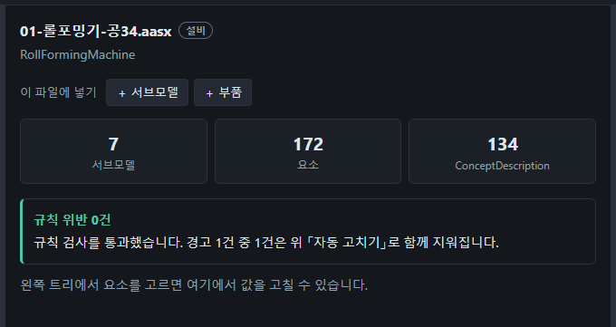

- 제목 옆 배지 **「설비」/「공정·회사」** — 이 파일이 설비 한 대인지 묶음인지. 넣을 수 있는 것이 달라집니다(7장)
- **「이 파일에 넣기」** 줄 — 설비: ＋ 서브모델 · ＋ 부품 / 묶음: ＋ 설비 · ＋ 공정 · ＋ 서브모델
- 타일 — 서브모델 · 요소 · ConceptDescription 수
- **판정** — 위반 N건 / 경고 M건. 새로 만든 파일은 **비어 있는 서브모델 이름까지** 알려 줍니다(규칙은 형식만 보므로 비어 있어도 위반 0건)

### 트리에서 찾기

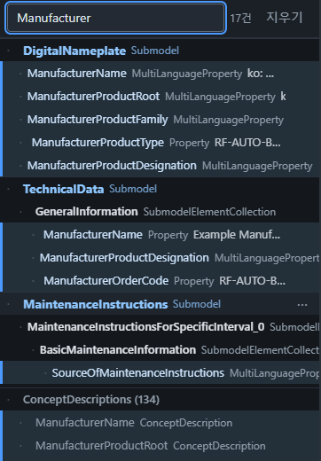

한 파일에 요소가 200개를 넘습니다. 트리 위 **찾기 칸**에 넣으면 걸린 것만 남습니다 — **이름 · 종류 · 값 · semanticId · id**
(대소문자 안 가림). 걸린 줄은 파랗게, 거기까지 가는 길(상위)도 함께 남습니다. `Esc` 또는 「지우기」로 되돌립니다.

> 예: `RFL-2026`(값)으로 일련번호를, `0173-1#02`(semanticId)로 표준 사전을 쓴 요소를 한 번에 모아 봅니다.

---

## 4. 설비 한 대 만들기 — 처음부터 끝까지

프레스 기계 `PressMachine` 한 대를 예로 끝까지 갑니다.

### 4-1. 새로 만들기

**파일 ▾ → 새로 만들기**(또는 첫 화면의 「새로 만들기」) → **「설비」**.

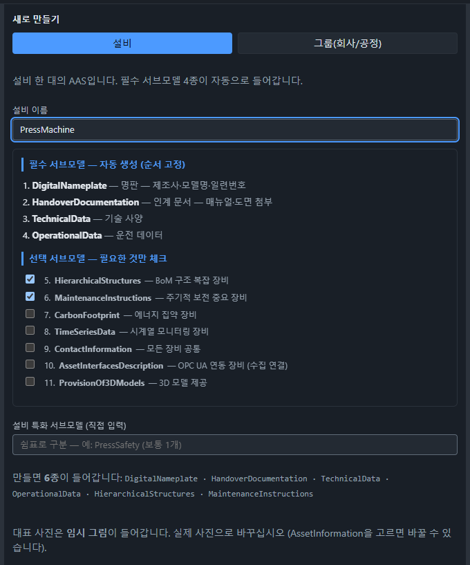

1. **설비 이름** — 예: `PressMachine`. 🔴 **영문으로 시작, 영문·숫자·밑줄만.** 이 이름이 id에 그대로 들어갑니다
2. **필수 서브모델 1~4번은 자동**으로 들어갑니다(순서 고정 — KOSMO 규칙)
3. **선택 서브모델 5~11번**은 장비 성격에 맞는 것만 체크(기본은 5·6번)
4. 설비 특화 서브모델이 있으면 직접 입력 칸에 쉼표로 — 예: `PressSafety`
5. 「만들면 N종이 들어갑니다」를 확인하고 **「만들기」**

> 총 **6~8종**이어야 합니다(KOSMO-AAS-4). 9종부터는 만들자마자 위반이라 미리 알려 줍니다.

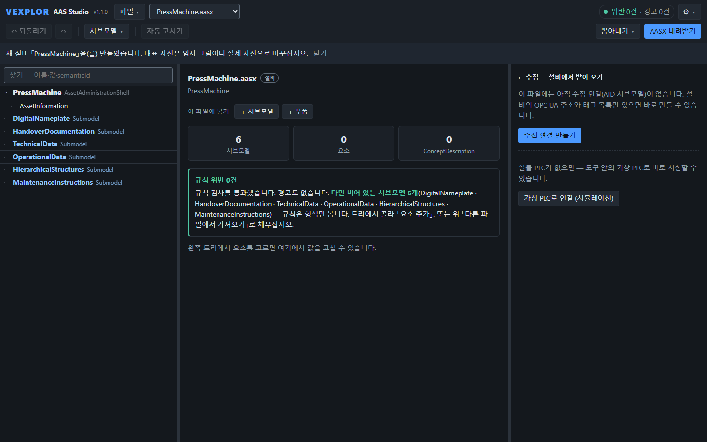

만들자마자 파일이 열립니다. 뼈대(서브모델 6종)만 있고 **요소는 0개**입니다 — 판정 줄이 *"비어 있는 서브모델 6개"* 라고
이름까지 알려 줍니다. 이제 채웁니다.

### 4-2. 요소 추가 — 값 하나 넣어 보기

트리에서 **서브모델(예: DigitalNameplate)을 우클릭** → **「요소 추가」**. (가운데 칸의 「요소 추가」 버튼도 같습니다)

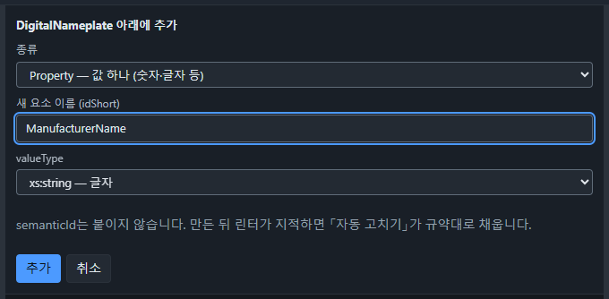

| 칸 | 넣는 것 |
|---|---|
| 종류 | `Property`(값 하나) · `MultiLanguageProperty`(언어별 글) · `Range`(최소~최대) · `File`(첨부) · `SubmodelElementCollection`(묶음) … |
| 새 요소 이름 (idShort) | 영문 CamelCase — 예: `ManufacturerName` |
| valueType | Property·Range일 때. `xs:string` 글자 · `xs:int` 정수 · `xs:double` 소수 · `xs:boolean` 참/거짓 · `xs:date` 날짜 |

**semanticId는 비워 두어도 됩니다.** 린터가 지적하고 「자동 고치기」가 규약대로 채워 줍니다(4-8).

「추가」를 누르면 트리에 생기고, 그 요소를 고르면 값을 넣을 수 있습니다.

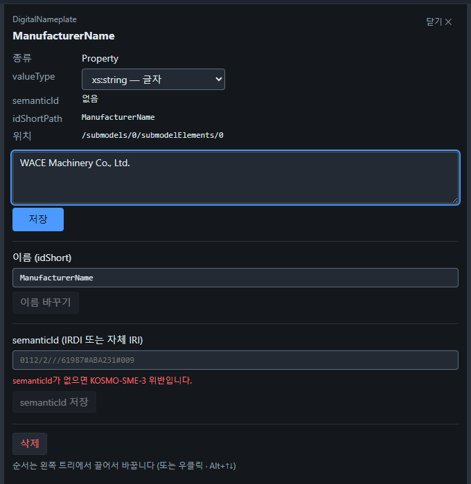

| 자리 | 무엇 |
|---|---|
| 맨 위 글상자 | **값**. MultiLanguageProperty는 언어별 칸, Range는 최소·최대 |
| valueType | 선택 상자 — 만들 때 안 정했으면 여기서 바꿉니다(예: 온도를 `xs:double`로) |
| 이름 (idShort) | 오타를 고칩니다(5장 「이름 바꾸기」) |
| semanticId | IRDI(표준 사전) 또는 자체 IRI. 입력하는 자리에서 형식을 검사합니다 |
| 사본 만들기 · 삭제 | 담는 요소(SMC·SML)에만 「사본 만들기」가 있습니다(5장) |

**「저장」**을 누르면 서버에 바로 저장됩니다. 따로 저장 버튼을 찾을 필요가 없습니다.

### 4-3. 값 한꺼번에 입력 — 서브모델 값 표

요소를 하나씩 눌러 40번 저장하지 않아도 됩니다. **서브모델을 고르면** 안의 값이 표로 나옵니다.

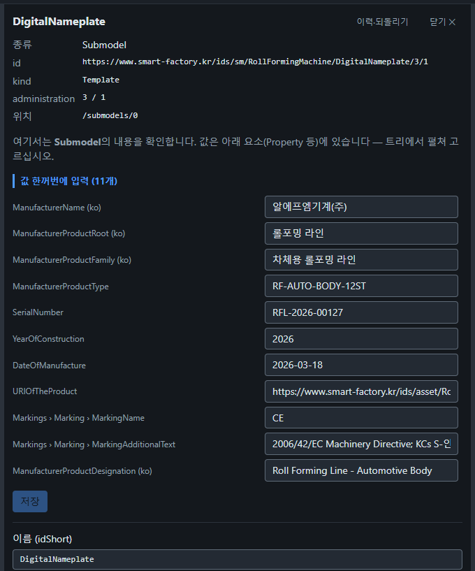

줄줄이 고치고 **「바뀐 n개 저장」** 한 번이면 끝. Property · 다국어의 첫 언어 · Range(`min~max`)가 대상입니다.

### 4-4. 뼈대를 빨리 채우기 — 서브모델 추가 · 다른 파일에서 가져오기

**서브모델 추가** — 헤더 **서브모델 ▾ → 서브모델 추가**. id·kind(Template)·semanticId·administration을 규칙에 맞게 자동으로 채웁니다.

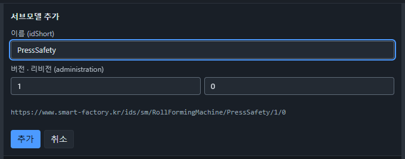

**다른 파일에서 가져오기** — 헤더 **서브모델 ▾ → 다른 파일에서 가져오기**. 이미 올려 둔 다른 AASX(골든 파일·IDTA 템플릿)에서
서브모델을 **통째로 복사**합니다. 새 설비의 명판·기술사양을 비슷한 설비에서 가져와 값만 고치는 것이 가장 빠른 길입니다.

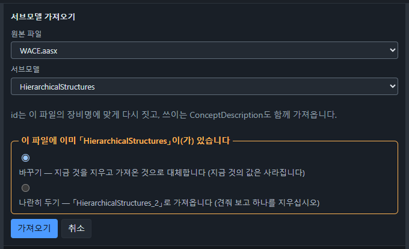

- id를 **가져오는 쪽 장비명에 맞게 다시 짓고**, 쓰이는 **ConceptDescription도 함께** 가져오고, AAS 참조도 자동으로 맵니다
- 같은 이름이 이미 있으면 **「바꾸기」**(옛것을 지움) / **「나란히 두기」**(`이름_2`) 중 고릅니다. 둘 남으면 경고가 뜹니다
- IDTA 공식 템플릿도 이 길로 넣으십시오. 손으로 만들면 표준 semanticId가 빠져 지적이 요소 수만큼 뜹니다
- **매번 올리지 않으려면** 서버의 템플릿 폴더(Docker `templates/`, 소스에서 띄울 때 `AAS_TEMPLATES_DIR`)에 `.aasx`를 두면 기동 때 자동으로 올라옵니다

### 4-5. 매뉴얼·도면 붙이기 — 첨부 파일

제출물의 실체는 **HandoverDocumentation 안의 문서 파일**입니다. 경로만 적으면 껍데기이므로 **파일 자체를 넣습니다.**

1. 트리에서 문서 요소(종류 `File`)를 고릅니다 — 찾기 칸에 `DigitalFile`을 치면 빠릅니다
2. 가운데 **「첨부 파일」** → **「파일 고르기」**
3. *"「설치매뉴얼.pdf」을(를) 붙였습니다"* 가 뜨면 끝

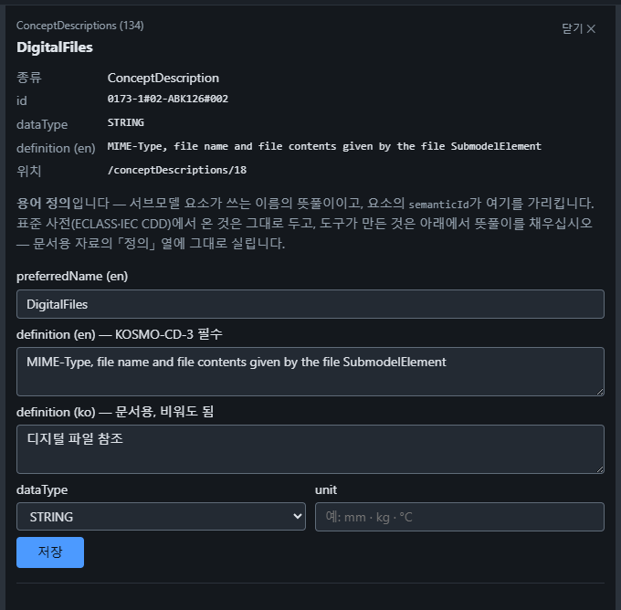

- 붙인 파일은 내려받은 AASX 안에 `aasx/suppl/파일명`으로 함께 들어가고, 요소의 값(`file:///aasx/suppl/…`)도 **자동으로 맞춰집니다** — 따로 적지 마십시오
- 「붙어 있음: 파일명」으로 확인, 「첨부 지우기」로 떼어냅니다. 큰 PDF도 서버가 받으므로 브라우저가 멈추지 않습니다

### 4-6. 대표 사진

새 파일에는 **임시 그림**이 들어갑니다. 트리의 **AssetInformation**을 고르면 「대표 사진」 올리는 칸이 있습니다.
실제 장비 사진(PNG·JPG)을 올리면 임시 그림은 자동으로 정리됩니다. `assetKind`(Type이어야 함)·`globalAssetId`도 여기서 봅니다.

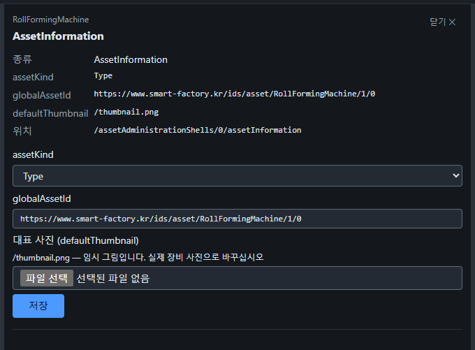

### 4-7. 용어 정의 — ConceptDescription

요소가 쓰는 이름의 **뜻풀이**입니다. 요소의 semanticId가 여기를 가리킵니다. 트리 맨 아래 「ConceptDescriptions (n)」에서 고릅니다.

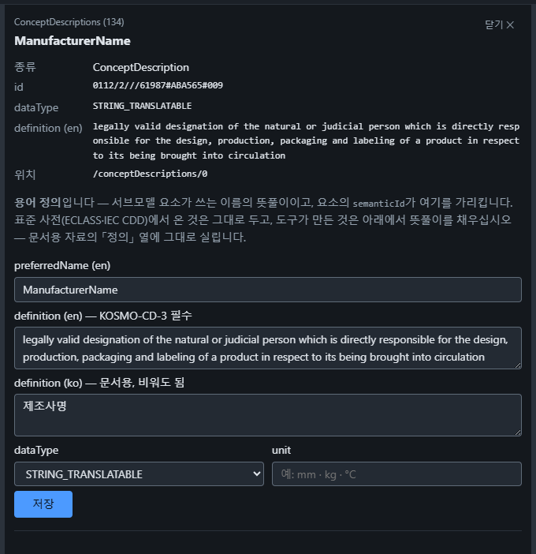

- 표준 사전(ECLASS·IEC CDD)에서 온 것은 그대로 둡니다
- 「자동 고치기」가 임시로 채운 정의(idShort와 같은 것)는 **영문 정의(KOSMO-CD-3 필수)**를 진짜 정의로 바꿉니다 — 개발계획서 원문을 인용하고 창작하지 않습니다
- 한글 정의는 문서용(비워도 됨). dataType·unit은 문서용 자료의 표에 그대로 실립니다

### 4-8. 지적 확인 → 자동 고치기

헤더의 **「위반 N건 · 경고 M건」** 칩을 누르면 목록이 뜹니다.

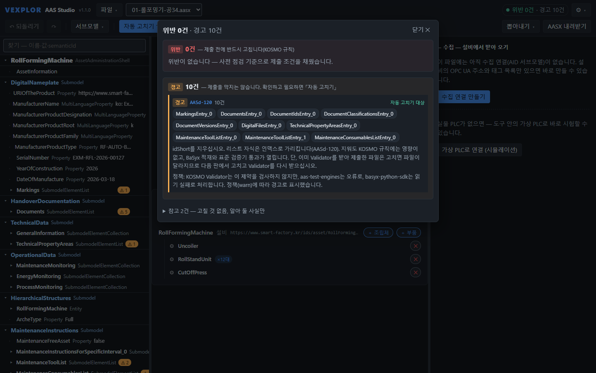

| 등급 | 뜻 |
|---|---|
| **위반**(빨강) | KOSMO Validator가 떨어뜨릴 것. 제출 전에 0건이어야 합니다 |
| **경고**(주황) | 제출은 통과하지만 알아 둘 것(표준 도구 호환 등) |
| **참고**(접힘) | 고칠 것 없음 — 알아 둘 사실만 |

같은 규칙은 한 카드로 묶이고, 항목을 누르면 **그 요소가 트리에서 열립니다.** 오른쪽 위 「자동 고치기 대상」이 붙은 것은 버튼 한 번으로 해결됩니다.

**「자동 고치기 N건」**(파란 버튼)을 누르면 **바로 고치지 않고 미리보기 팝업**이 먼저 뜹니다 — 항목마다 **무엇을 · 전 → 후**를 보여 주고, **체크한 것만** 반영합니다.

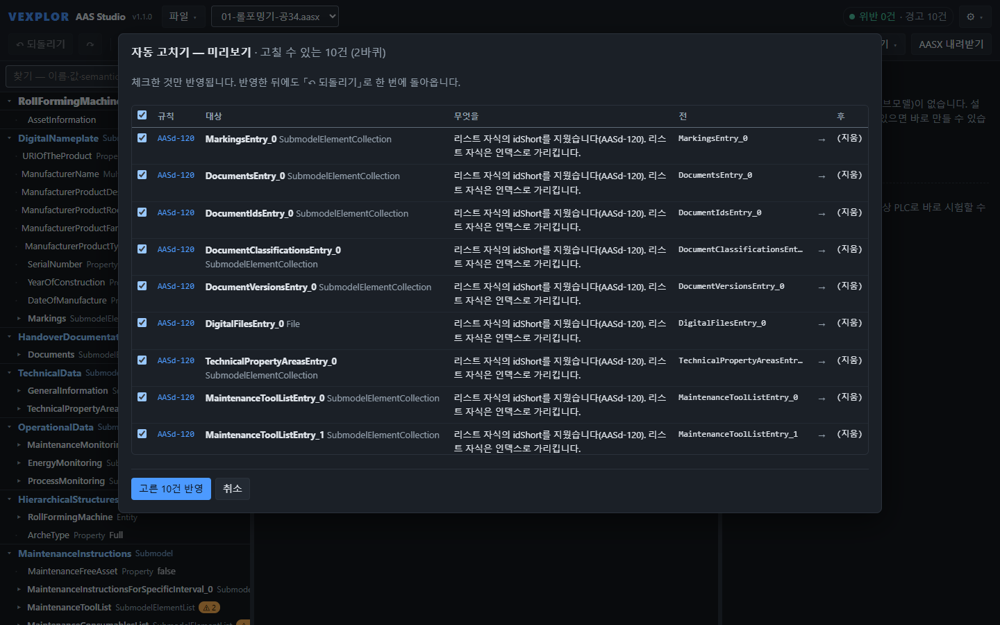

| 칸 | 뜻 |
|---|---|
| ☑ | 반영할지. 「전체 고르기」로 한꺼번에 켜고 끕니다 |
| 규칙 · 대상 | 어느 규칙이 어느 요소를 |
| 무엇을 | 어떻게 고치는지 한 줄 |
| 전 → 후 | 바뀌기 전 값과 후 값(마우스를 올리면 전부). 없던 것을 채우면 「(없음) → 값」, 지우는 교정이면 「값 → (지움)」 |

- 「고른 N건 반영」을 누르면 그때 고칩니다. 여러 바퀴 돌아 가려져 있던 다음 지적까지 잡습니다
- 고칠 수 있는 **경고도 함께** 목록에 오릅니다(AASd-120 등) — 원하지 않으면 체크를 끄면 됩니다
- **자동으로 못 고치는 것은 이유와 함께** 팝업 아래에 접혀 있습니다 — 값이나 정의를 창작해야 하는 것은 사람 몫입니다. 단추의 「N건」은 **실제로 고쳐질 수**입니다(파일을 열 때 저장 없이 미리 계산) — 못 고치는 것만 남으면 단추가 잠기고 그 사실이 단추 설명에 나옵니다
- 반영한 뒤 위쪽 띠에 **교정 건수 · 몇 바퀴 · 남은 위반**이 뜹니다. 잘못 고쳐졌으면 **「↶ 되돌리기」** 한 번이면 그 전으로

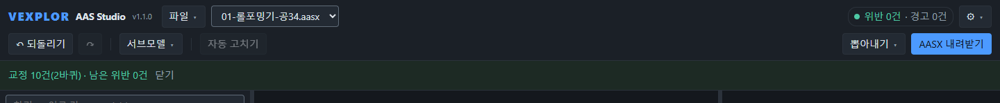

#### IRI를 옮기는 교정 — 이관 대장

세 규칙(`KOSMO-SM-3` · `KOSMO-SME-3` · `KOSMO-CD-2`)은 semanticId를 **자체 IRI**(`smart-factory.kr`)로 옮깁니다.
**KOSMO Validator가 IDTA 공식 IRI(`admin-shell.io`)를 거부하기 때문**입니다(20종 작업 실측: 167종·참조 1,358건).
KTL 규정("IDTA IRI는 변경 없이")과 정면 충돌하는 자리라 **"KOSMO 통과 우선, 대신 되돌릴 수 있게"**로 정했습니다.

- 미리보기가 *"이 중 N건은 IDTA 공식 IRI를 자체 IRI로 옮기는 교정입니다"* 라고 먼저 알립니다
- 옮긴 원본은 **이관 대장**(`/aasx/_idta_relocated_iris.json`)에 남아 **내려받는 .aasx 안에 함께 들어가고**, 검증 결과서에도 표로 실립니다
- 요약 화면의 *"IDTA 공식 IRI를 자체 IRI로 옮긴 것 N건이 이관 대장에 있습니다"* 줄에서 **「원본 IRI로 되돌리기」** — 규정 해석이 바뀌었을 때 한 번에 돌아갑니다(되돌리면 KOSMO 우선 정책에서는 다시 위반으로 잡힙니다 — 그때는 정책을 `iriConflict=preserve`로)

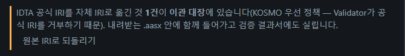

- 공식 IRI를 그대로 두고 싶으면 정책 `iriConflict=preserve`, 표준 템플릿(AID 등) 용어만 지키려면 `standardTemplateSemantics=preserve`(10장)
- `KOSMO-SME-3`이 만든 ConceptDescription의 **정의는 자리표시자**(idShort 그대로)입니다 — 4-7에서 진짜 정의로 바꿔야 KOSMO-CD-3을 넘습니다

남는 지적의 대처는 [부록 A](#부록-a-자주-만나는-지적과-대처)에 있습니다.

### 4-9. 검증 결과서

**뽑아내기 ▾ → 검증 결과서**를 누르면 새 탭에 결과서가 열립니다. **브라우저에서 인쇄하면 그대로 제출용 PDF**입니다.

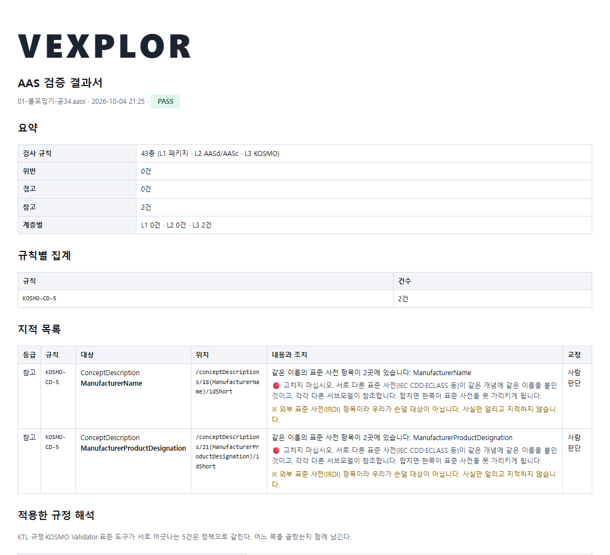

요약 · 규칙별 집계 · 지적 목록(위반 → 경고 → 참고 순, 위치·조치) · **어떤 규정 해석으로 검사했는지**가 실립니다.

> 이 결과서는 **자체 린터**의 결과이지 KOSMO Validator의 출력이 아닙니다. 문서에도 그렇게 적혀 있습니다.

### 4-10. AASX 내려받기 — 제출 점검표

**「AASX 내려받기」**로 저장합니다. 편집한 내용·첨부가 그대로 들어갑니다. **위반이 남아 있으면 한 번 되묻습니다** — 중간 저장이면 그대로 진행해도 됩니다.

1. **화면에서 위반 0건** — 경고는 남아도 됩니다
2. 「AASX 내려받기」로 저장한 파일로 아래를 확인
3. 표준 검증기 — `out/venv/bin/python scripts/aas-test-engines.py 내려받은파일.aasx` (설치: `python3 -m venv out/venv && out/venv/bin/pip install aas-test-engines==1.0.3`)
4. BaSyx에 올릴 계획이면 — `out/venv/bin/python scripts/basyx-check.py 내려받은파일.aasx --expect-submodels 7`
5. **KOSMO Validator에 제출** — 최종 합격 판정은 Validator가 합니다
6. 결과서를 인쇄해 PDF로 보관

---

## 5. 편집 조작 모음

### 트리 우클릭 메뉴 (「⋯」)

트리 줄에 마우스를 올리면 오른쪽 끝에 **「⋯」**가 나옵니다. 누르거나 **우클릭**하면 그 줄로 할 수 있는 일이 나옵니다.

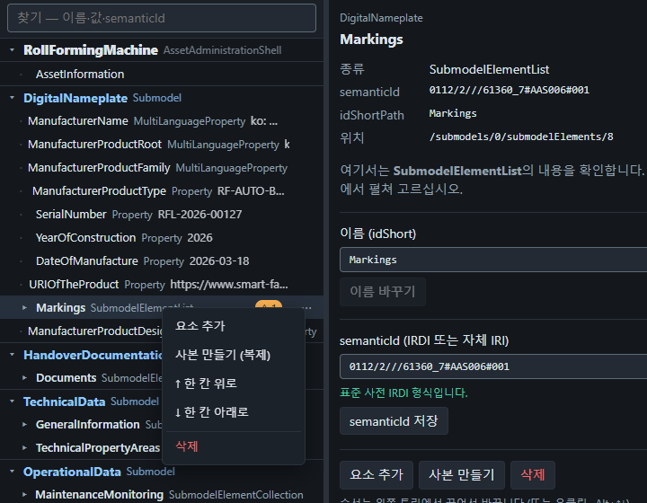

| 줄 | 메뉴 |
|---|---|
| 서브모델 · 담는 요소(SMC·SML·Entity) | 요소 추가 · **사본 만들기** · 한 칸 위로/아래로 · 삭제 |
| 낱개 요소(Property 등) | 한 칸 위로/아래로 · 삭제 |
| 맨 위 AAS | 서브모델 추가 · ＋ 부품 (묶음 파일: ＋ 공정 · ＋ 설비 · 서브모델 추가) |
| ▦ 공정 · ⚙ 설비 (묶음 파일) | 7장 |

**사본 만들기**는 담는 요소에만 있습니다 — 두 번째 인증 마크·문서·연락처처럼 **안의 요소와 값까지 구조째** 하나 더 넣을 때.
바로 아래에 `이름_2`로 생깁니다.

### 순서 바꾸기

왼쪽 트리에서 요소를 **끌어서** 형제 사이에 놓습니다(파란 줄이 놓일 자리). 마우스 없이면 `Alt+↑`·`Alt+↓`, 또는 우클릭 메뉴.
요소 순서는 문서(가이던스 표)에 나오는 순서입니다. 다른 부모로 옮기는 것은 받지 않습니다.

### 이름(idShort) 바꾸기 — 막히는 두 경우

요소·서브모델을 고르면 **「이름 (idShort)」** 칸이 있습니다. 고치고 「이름 바꾸기」. 두 경우는 거부됩니다.

| 거부 | 왜 |
|---|---|
| 같은 자리에 **이미 그 이름이 있을 때** | 형제끼리 이름이 겹치면 엉뚱한 요소가 조용히 고쳐집니다(AASd-022) |
| **리스트 자식**(`MarkingsEntry_0` 같은 것) | 리스트 자식은 순서로 가리킵니다. 이름을 붙이면 BaSyx가 그 가지를 통째로 잃습니다(AASd-120). 아예 이름칸이 나오지 않습니다 |

### 되돌리기 · 다시 하기

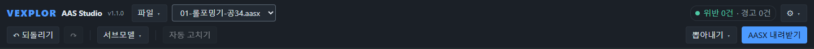

헤더 **「↶ 되돌리기」**(`Ctrl+Z`) · **「↷」**(`Ctrl+Shift+Z`). 값 편집·삭제·순서·복제·자동 고치기·가져오기 —
**어떤 변경이든 한 번 눌러 방금 것을 되돌립니다**(30단계). 버튼에 마우스를 올리면 무엇을 되돌리는지 보입니다.

- 되돌리기 목록은 **서버가 살아 있는 동안**만 남습니다. 오래된 상태로 가려면 아래 「이력」
- 파일 자체를 목록에서 지운 것은 되돌리기가 없습니다

### 이력 — 시점으로 되돌리기

서브모델을 고르고 **「이력·되돌리기」**를 누르면 그 서브모델의 변경 이력이 나옵니다. **「이 판으로 되돌리기」**로 그 시점 내용으로 돌아갑니다.
되돌리기 자체도 이력에 남아 또 되돌릴 수 있습니다. 이력은 서버에 보관됩니다.

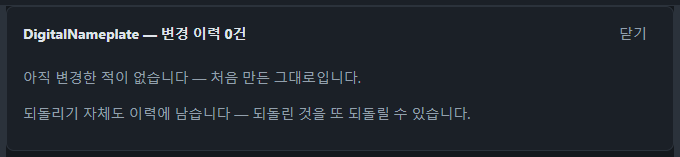

### 여럿이 같이 고칠 때

다른 사람이 같은 서브모델을 먼저 고쳤으면 저장이 거부되고 *"다른 곳에서 먼저 바뀌었습니다. 내 수정은 저장하지 않았습니다"* 가 뜹니다.
**「다시 읽기」** 후 이어서 편집합니다. 남의 편집을 덮어쓰지 않습니다.

---

## 6. 부품 구성 (BoM)

설비 파일의 요약 아래 **「부품 구성 (BoM)」** — 이 설비가 어떤 부품으로 이루어졌는지 적는 자리입니다.
파일 안의 **HierarchicalStructures 서브모델(IDTA 02011)**에 저장됩니다.

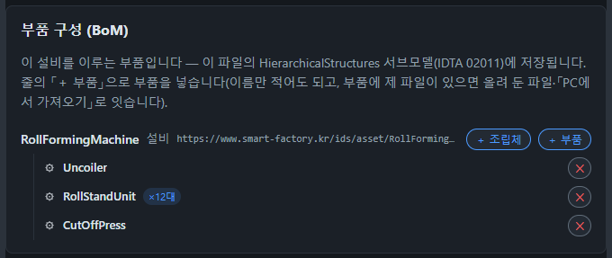

- 설비 줄의 **「＋ 부품」** — 이름만 적어도 됩니다(부품은 대개 제 파일이 없습니다). 부품에 제 AASX가 있으면 올려 둔 파일에서 고르거나 「PC에서 가져오기」
- **「＋ 조립체」** — 부품을 묶는 층(모듈·조립체). 예: `Joint2Module` 밑에 `J2Reducer` · `J2Motor`
- 같은 부품이 여러 개면 **대수**(`×12대`) — 골든 파일의 RollStandUnit 12대와 같은 표준 필드 `BulkCount`
- 「✕」로 뺍니다. 조립체를 빼면 그 밑 부품은 한 층 위로 올라옵니다

같은 내용이 왼쪽 트리 **HierarchicalStructures 서브모델** 안에 표준 Entity 트리로 보입니다 — 그쪽이 파일에 실제로 들어 있는 것이고, 이 패널은 그것을 고치는 자리입니다.

---

## 7. 회사·공정 묶음 만들기

여러 설비를 **회사 → 공정 → 설비**로 묶은 파일입니다. 표준에서 AAS의 대상은 설비만이 아니라 공정·라인·공장도 정식 대상입니다.

### 파일은 따로, 끈으로 잇는다

묶음 파일은 **자기 안에 설비 상세를 담지 않습니다.** `globalAssetId`라는 주소 하나로 설비 파일을 가리킬 뿐입니다.

```
SampleFactory.aasx  (묶음)
   ▦ PressLine
      ├ RollFormingMachine ×2대  →  …/asset/RollFormingMachine/1/0   ← 01-롤포밍기.aasx의 Asset
      └ Cutter01 (예정)          →  …/asset/Cutter01/1/0            ← 나중에 이 이름으로 파일을 만들면 이어짐
   ▦ WeldingLine
```

설비를 고치면 설비 파일만 고칩니다. 묶음 파일은 그대로 — **원본은 한 군데**입니다.
🔴 그래서 **다른 곳에 줄 때는 묶음 파일 + 설비 파일들을 함께** 줘야 합니다.

### 7-1. 만드는 순서

**파일 ▾ → 새로 만들기 → 「그룹(회사/공정)」**

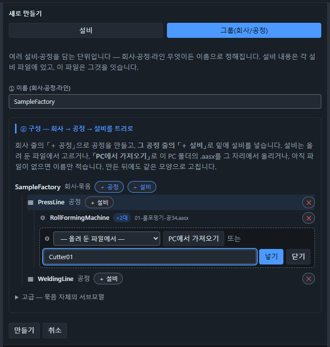

1. **① 이름** — 회사든 공정이든 라인이든 이름으로 정해집니다(예: `SampleFactory`)
2. **② 구성 — 트리로 그립니다.** 규칙은 하나:
   - 회사 줄의 **「＋ 공정」** → 공정 이름 적고 Enter (연달아 여러 개, 「닫기」로 끝)
   - 그 공정 줄의 **「＋ 설비」** → 설비를 넣습니다. 세 갈래:

   | 갈래 | 언제 |
   |---|---|
   | **올려 둔 파일에서** 고르기 | 설비 AASX가 이미 서버에 있을 때 |
   | **「PC에서 가져오기」** | 설비 AASX가 PC 폴더에 있을 때 — 올리자마자 골라진 상태가 됩니다. 「넣기」만 |
   | **이름만** 적기 | 아직 파일이 없을 때 — **「예정」** 배지가 붙고, 나중에 같은 이름으로 설비 파일을 만들면 저절로 이어집니다 |

   - 같은 설비가 여러 대면 **대수**를 적습니다(×2대). 대별로 수집까지 할 거면 **「호기별」**을 켜면 `이름_1`·`이름_2` 파일이 따로 만들어집니다(아래)
   - 「✕」로 빼고, 공정을 빼면 그 밑 설비는 한 층 위로 올라옵니다
3. 트리가 그대로 미리보기입니다 — **「만들기」**

> 화면은 **회사 → 공정 → 설비 세 층**만 그립니다. 이름은 영문 시작·영문/숫자/밑줄 2자 이상, `HasPart_`로 시작하면 안 됩니다.

### 7-2. 만든 뒤 화면

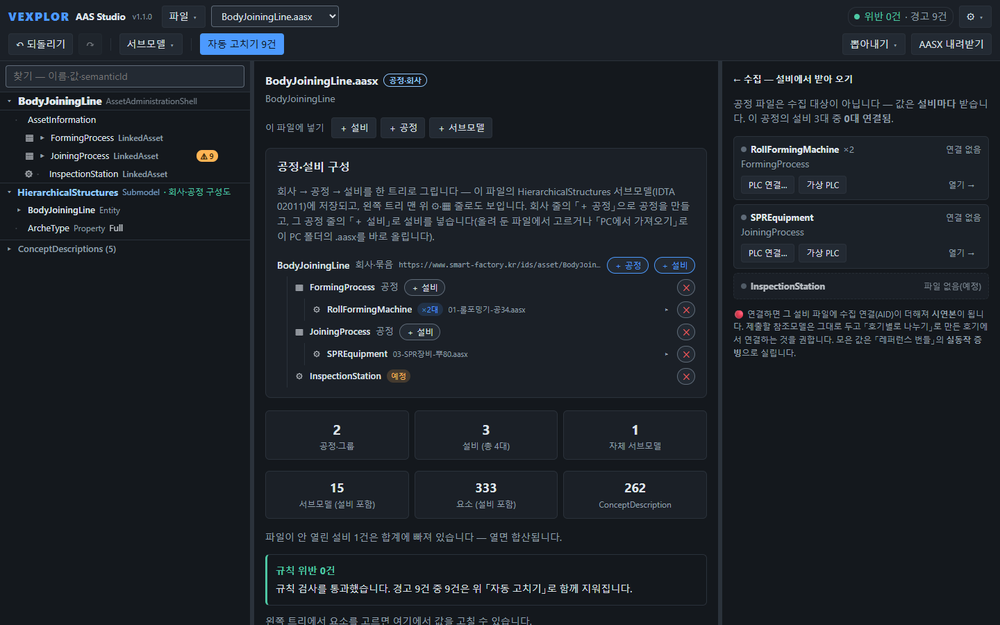

- 요약 바로 밑에 **「공정·설비 구성」** 패널 — 만들 때와 **같은 트리 편집기**로 더 넣고 뺍니다
- 타일은 두 줄 — 「구성」(공정·설비 수)과 「합계」(들어간 설비까지 합친 서브모델·요소·CD 수). 안 열린 설비 파일은 합계에서 빠지고 그 사실이 표시됩니다
- 묶음에는 설비용 필수 4종(명판 등)을 **넣지 않습니다** — 서브모델은 계층(HierarchicalStructures) 하나로 시작합니다. 더 필요하면 「서브모델 추가」

### 7-3. 트리 읽는 법

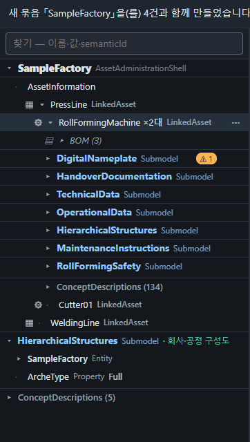

| 줄 | 뜻 |
|---|---|
| **▦ PressLine** `LinkedAsset` | 공정(층). 파일이 없습니다 |
| **⚙ RollFormingMachine ×2대** `LinkedAsset` | 설비. 파일이 올라와 있으면 펼쳐집니다 |
| ⚙ 밑 **▤ BOM (3)** | 그 설비의 부품 구성 — 접혀 있습니다. 펼치면 `· Uncoiler Part …` |
| ⚙ 밑 **DigitalNameplate …** | **그 설비 파일의** 서브모델. 여기서 바로 고칠 수 있고 저장은 그 설비 파일로 갑니다(편집기 위에 🔗 안내) |
| ⚙ Cutter01 (예정) | 파일이 아직 없는 설비 — 이름만 |
| **HierarchicalStructures** `Submodel · 회사·공정 구성도` | 파일 안에 실제로 들어 있는 것. 위의 ▦·⚙ 줄은 이 내용을 읽기 좋게 그린 것입니다 |

> **설비에도 회사에도 같은 HierarchicalStructures가 있는 이유** — 주어가 다릅니다. 설비의 것은 *이 설비가 무엇으로*(부품),
> 회사의 것은 *이 회사가 무엇으로*(공정·설비). 표준은 각 층의 AAS가 자기 한 단계 아래를 적도록 만들어져 있어 계층이 재귀로 이어집니다.
> 회사 파일의 그 줄에는 초록 글자로 **「· 회사·공정 구성도」**가 붙습니다.

**위반 지적도 한 자리에 모입니다** — 헤더 칩과 트리 배지에 설비 파일의 지적까지(파일명이 붙어) 합산되고, 누르면 그 위치로 갑니다.
「자동 고치기」는 지금 열린 파일에만 — 설비 지적을 고치려면 그 설비 파일을 엽니다.

### 7-4. ▦·⚙ 줄의 「⋯」 메뉴

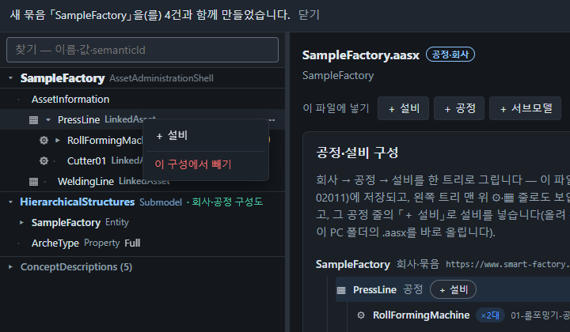

| 줄 | 메뉴 |
|---|---|
| 맨 위 AAS(회사) | ＋ 공정 · ＋ 설비 · 서브모델 추가 |
| ▦ 공정 | **＋ 설비** · 이 구성에서 빼기 |
| ⚙ 설비(파일 있음) | **이 설비에 서브모델 추가** · **이 설비 파일 열기** · 이 구성에서 빼기 |
| ⚙ 설비(이름만) | 이 구성에서 빼기 |

「이 구성에서 빼기」는 목록에서만 빼고 **파일은 지우지 않습니다.**
⚙ 설비 줄을 **누르면** 가운데에 그 설비의 동작이 나옵니다:

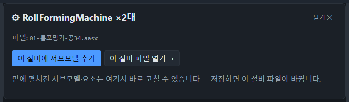

### 7-5. ×대수 vs 호기별

| | 뜻 | 언제 |
|---|---|---|
| **×n** | 같은 카탈로그(형식)로 n대 — 수량 | 구성 파악·부품 소요가 목적. 제조사·사양처럼 n대가 공유하는 정보까지만 참 |
| **호기별** | `이름_1 … 이름_n` 파일이 각각 — **원본 파일이 통째로 복제**(서브모델·첨부 포함, id는 호기 이름) | 대별 실측값 수집이 목적. 호기마다 값·수집 주소를 따로 고칩니다 |

수집 연결(AID)이 있는 설비를 ×2 이상으로 넣으면 도구가 이 사실을 경고합니다 — 그 수집값은 "그중 한 대"의 것일 뿐입니다.

### 7-6. 검사 규칙 3종 — 끈이 끊어지는 자리를 막는다

| 규칙 | 무엇을 보나 |
|---|---|
| **HIER-1** | 진입점(EntryNode)과 ArcheType이 있는가 |
| **HIER-2** | 자식이 가리키는 Asset 주소가 있는가 · 자기 자신을 매달지 않았는가 · 같은 설비가 두 번 있지 않은가 |
| **HIER-3** | 자식마다 HasPart 관계가 짝으로 있는가 |

순환(A가 B를 담고 B가 A를 담음)은 서버가 거부합니다. 설비 파일을 지울 때 그것을 가리키는 묶음이 있으면 먼저 알려 줍니다(9장).

> 🔴 묶음 파일 안에 설비 서브모델을 **복사해 넣는 방식(포함형)은 쓰지 않습니다** — 서브모델 수가 불어 KOSMO-AAS-4 위반 등 78건(실측).
> 파일은 참조로 잇고 **화면에서만** 이어 붙여 보여 줍니다.

### 7-7. 레퍼런스 번들 — 공정 단위 제출 꾸러미 (2026-09-30)

제조데이터 표준화 사업의 **레퍼런스 번들**은 장비 산출물(AASX·가이던스)을 **공정 단위로 묶은 꾸러미**입니다(번들 7건).
공정 파일이 번들의 뼈대입니다. 공정 파일에서 **뽑아내기 ▾ → 레퍼런스 번들**.

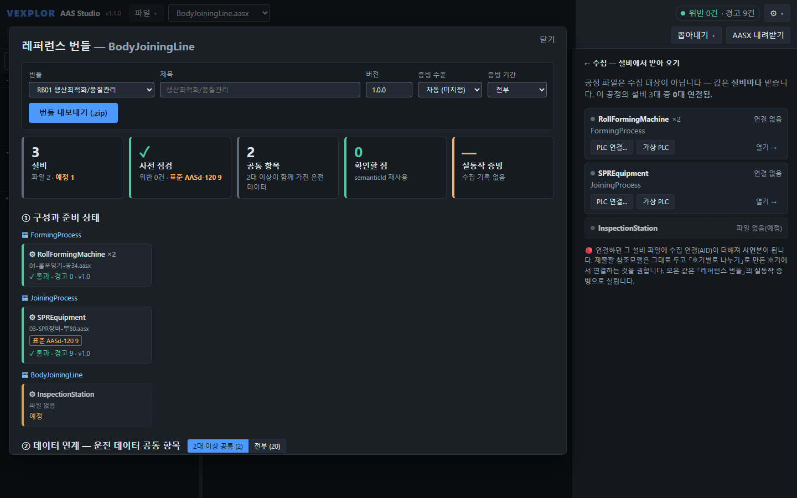

| 자리 | 보여 주는 것 |
|---|---|
| 숫자 다섯 | 설비(파일·예정) · 사전 점검(+ **표준 AASd-120** 건수) · 공통 항목 · 확인할 점 · 실동작 증빙 |
| ① 구성과 준비 상태 | 공정별 설비 카드 — 파일·버전·사전 점검. 점선은 **예정**, ⚡는 수집 연결이 붙은 **시연본** |
| ② 데이터 연계 | 운전 데이터를 **semanticId로 묶은 매트릭스** — ● 같은 이름 · ● 주황 다른 이름 · **≠** 같은 이름이 다른 semanticId(안 모임) |
| ③ 실동작 증빙 | 수집 기록 — 시연을 대신하는 자료(아래) |
| ④ 문서·첨부 | Use-Case · 가이던스 · 참고 자료를 넣는 곳(아래) |
| ⑤ 확인할 점 | semanticId만 믿으면 틀리는 곳 |

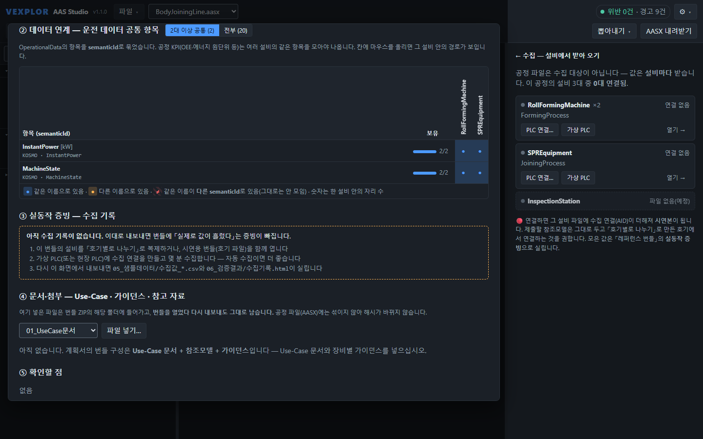

> 🔴 **semanticId만으로 연계하면 틀립니다**(사업 참조모델 30종 실측). ECLASS IRDI 하나(`0173-1#02-ABC132#004`)가
> MachineState·AlarmCode·JudgmentResult에 함께 쓰입니다. 연계는 **경로 + semanticId 쌍**으로 적고, 같게 볼지는 사람이 정합니다.

카드의 **「표준 AASd-120 n」** — KOSMO는 검사하지 않지만 표준 검증기(aas-test-engines)는 **오류**로 보고 BaSyx는 그 하위를
버립니다. 설비 파일을 열어 「자동 고치기」로 지우면 KOSMO에도 영향 없이 풀립니다(실측: 28번 장비 7건 → 표준 오류 0건, 요소 수 그대로).

#### 내보내기 · 열기

번들 코드(RB01~07)·제목·버전·증빙 수준·증빙 기간을 고르고 **「번들 내보내기 (.zip)」**.

```
RB01_생산최적화품질관리_v1.0.0/
├─ README.md               구성 트리 · 모델 표(버전·해시) · 실동작 증빙 · 재현 방법 · 사람이 넣은 문서
├─ bundle-manifest.json    모델·첨부마다 SHA256 · 증빙 요약 · 증빙 수준
├─ 00_공정구성/            공정 파일 (참조모델로 제출하지 않음)
├─ 01_UseCase문서/         작성 안내 + 넣은 문서
├─ 02_참조모델/            설비 AASX
├─ 03_가이던스/            넣을 목록 + 넣은 가이던스
├─ 04_데이터연계정의/      연계항목_초안.csv · 연계_확인사항.md
├─ 05_샘플데이터/          수집값_<호기>.csv
└─ 06_검증결과/            사전점검 결과서(참고) · 수집기록.html
```

- **같은 내용이면 같은 해시**입니다. 다시 뽑아 해시가 바뀌었다면 모델이 바뀐 것입니다
- **파일 ▾ → 번들 열기**로 ZIP을 고르면 공정·설비가 한 번에 올라오고 `해시 일치 n/n`이 뜹니다
- 🔴 **왕복 보존** — 번들을 열었다 다시 내보내도 **사람이 넣은 문서와 수집 기록이 그대로 남습니다.** 모델만 새 판으로 바꿔 다시 내는 흐름(1월 동기화)이 이것입니다
- 🔴 도구는 **Use-Case 문서·가이던스를 쓰지 않습니다.** 폴더와 채울 자리만 만듭니다
- 🔴 KOSMO Validator는 **장비별 AASX를 만들 때** 받는 검증입니다. 번들에는 공식 검증기가 없고, 화면의 ✓는 넣은 모델을
  다시 확인한 **참고 표시**입니다. 번들 자체는 해시 대조 · 공정 구성(HIER) · 데이터 연계 · 실동작 증빙으로 확인합니다

#### 실동작 증빙 — 시연을 못 하는 제출 자리를 위해

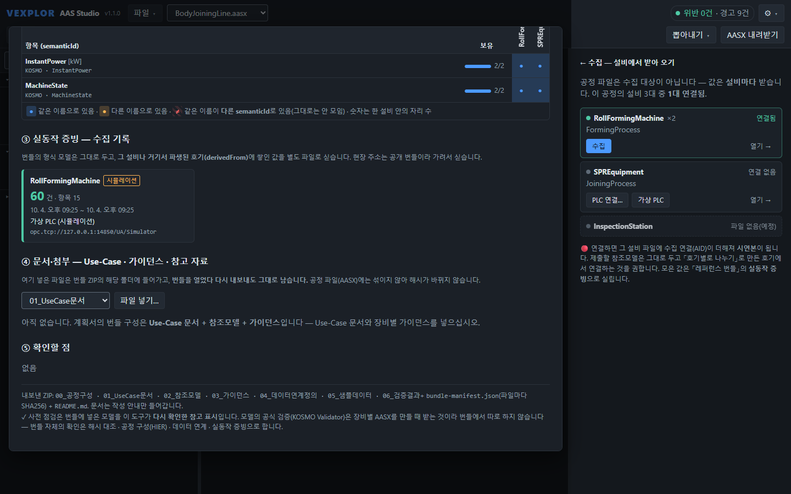

번들의 설비는 형식(Type)이라 값이 없습니다. 값은 「호기별로 나누기」로 만든 **호기**에 쌓입니다. 호기에는 표준 필드
`derivedFrom`(→ 원본 형식)이 붙어, 번들을 내보낼 때 **그 형식에서 파생된 호기의 수집값이 자동으로** 실립니다.

1. 번들의 설비를 「호기별로 나누기」 하거나 호기 파일이 든 시연용 번들을 함께 엽니다
2. 호기에 수집 연결(현장 PLC 또는 「가상 PLC로 연결」)을 만들고 몇 분~몇십 분 수집합니다 — `COLLECT_INTERVAL=5`면 자동
3. 번들 화면 **③**에 건수가 보이면 **증빙 수준**(A 현장 / B 재현 / C 시뮬레이션)과 **증빙 기간**(전부·최근 N분)을 고르고 내보냅니다

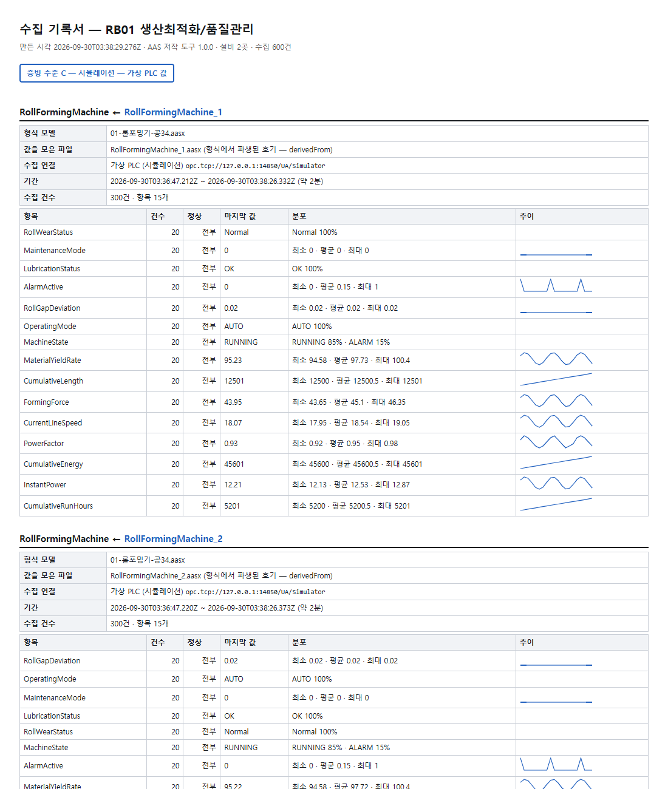

- `06_검증결과/수집기록.html` — 수집 연결·기간·건수, 항목별 통계·추이, 상태 분포(RUNNING 85% 등). 인쇄하면 PDF
- 🔴 **현장 PLC 주소는 가려서 싣습니다**(`opc.tcp://(비공개):4840/…`). 번들은 GitHub에 공개됩니다
- 번들을 다시 열었는데 새로 모은 값이 없으면 **이전 번들의 수집 기록을 이어받아** 싣습니다(카드에 「이어받음」). 새로 수집하면 통째로 새 기록으로 바뀝니다
- 수집값은 모델에 되쓰지 않습니다(값 동기화 A안)

#### 문서·첨부 — Use-Case · 가이던스 · 참고 자료

번들 화면 **④**에서 폴더를 고르고 **「파일 넣기…」**. 넣은 파일은 번들 ZIP의 그 폴더에 들어가고 manifest에 해시가 남습니다.
**번들을 열었다 다시 내보내도 남습니다.** 공정 파일(AASX)에는 섞이지 않아 공정 파일 해시가 바뀌지 않습니다.

- 넣을 수 있는 폴더: `01_UseCase문서 · 03_가이던스 · 04_데이터연계정의 · 05_샘플데이터 · 06_검증결과`
- README·manifest·참조모델·사전점검처럼 **도구가 만드는 파일**은 넣을 수 없습니다(내보낼 때마다 새로 만듭니다)

---

## 8. 현장 값 수집 (OPC UA)

파일에 **AssetInterfacesDescription(AID)** 서브모델이 있으면 오른쪽 칸에 수집 표가 나옵니다.
AID가 **어디에 접속해 무엇을 읽을지**(OPC UA 주소·NodeId)를 정합니다 — IDTA 표준 템플릿이라 자체 매핑표를 따로 두지 않습니다.

서버를 **`COLLECT=on`**으로 띄워야 합니다.

> 🔴 **수집값은 모델(AASX)에 되쓰지 않습니다.** 산출물이 형식(Type)이기 때문입니다. 값은 시계열 저장소에만 쌓이고 파일은 그대로입니다.

### 8-1. 수집 연결 만들기

AID가 없으면 오른쪽 칸에 **「수집 연결 만들기」**가 뜹니다.

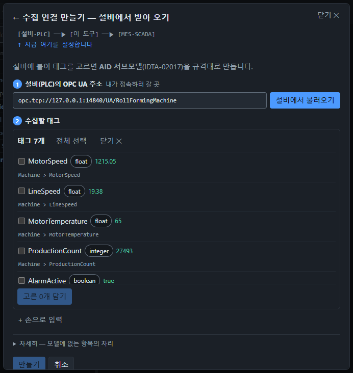

1. **① 설비(PLC)의 OPC UA 주소** — 예: `opc.tcp://192.168.0.50:4840`. 🔴 **이 도구 자신의 내주는 주소(8-6절)가 아닙니다** — 넣으면 도구가 막습니다
2. **「설비에서 불러오기」** — 설비에 붙어 태그를 훑어 옵니다. 지금 값·자료형이 보이므로 무엇인지 확인하며 고릅니다
3. 필요한 태그를 체크하고 **「고른 N개 담기」**. 손으로 넣으려면 「＋ 손으로 입력」(태그 이름 · NodeId `ns=1;s=Machine.MotorSpeed` · 단위)
4. **「만들기」** — AID 서브모델(IDTA-02017)이 규격대로 생깁니다

> 🔴 태그 이름은 **모델 요소(idShort)와 같게** 지으십시오. 그래야 표준 API로 내보낼 때 그 자리에 얹힙니다(8-5).
> 이름이 안 맞으면 *"6개 중 2개만 모델 요소와 이름이 맞습니다"* 처럼 알려 줍니다.

이미 연결이 있으면 「연결수정」으로 바꾸고, 안 쓸 거면 「연결삭제」(이미 수집한 값은 남습니다).

### 8-2. 수집하기

**「수집」**을 누르면 즉시 읽어 표에 최근 값·시각을 보여 줍니다.

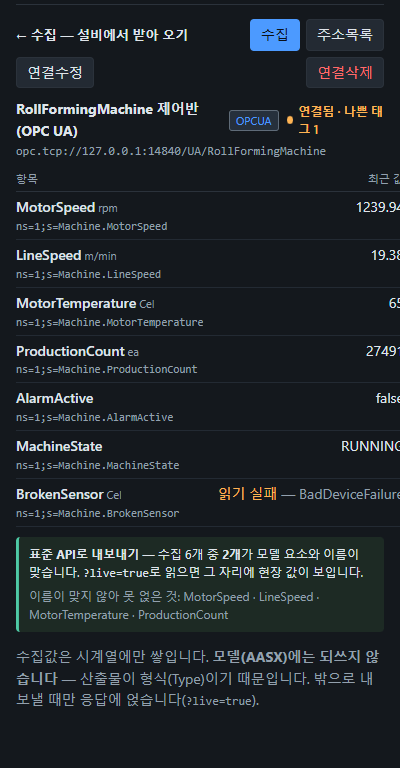

| 표시 | 뜻 |
|---|---|
| 🟢 **연결됨** | 마지막 수집에서 접속·읽기 모두 성공 |
| 🟡 **연결됨 · 나쁜 태그 N** | 접속은 됐는데 일부 태그를 못 읽음(NodeId 오타 등). 그 줄에 **「읽기 실패 — 사유」** |
| 🔴 **접속 실패** | 서버에 못 붙음 — 주소·방화벽 |
| ⚪ **수집 전** | 아직 한 번도 안 붙어 봄 |
| 「값 대기」 | 붙어서 읽었으나 아직 값이 안 올라옴 — **고장이 아닙니다** |

상태는 **마지막으로 실제 접속해 본 결과**입니다 — 추측하지 않습니다. 시각은 이 PC의 시간입니다.
「주소목록」은 지금 표를 CSV로 뽑습니다 — 시운전·검수에 넘기는 목록입니다.

### 8-3. 실물 PLC 없이 시험하기 — 가상 PLC

장비가 없어도 끝까지 볼 수 있습니다.

```bash
node scripts/plc-simulator.mjs                                   # 창 ③ — 가상 PLC (14840)
node scripts/make-demo-aasx.mjs                                  # → out/demo/롤포밍기-수집시연.aasx
COLLECT=on LINT_STANDARD_TERMS=preserve node apps/api/dist/server.js
```

시연 파일을 열고 「수집」. 또는 아무 설비 파일에서 「수집 연결 만들기」에 **`opc.tcp://127.0.0.1:14840/UA/RollFormingMachine`**을 넣고 「설비에서 불러오기」.

| 태그 | 무엇 |
|---|---|
| MotorSpeed · LineSpeed · MotorTemperature | 시간에 따라 흔들리는 값 |
| ProductionCount | 계속 증가 |
| AlarmActive · MachineState | 40초마다 5초간 알람 |
| **BrokenSensor** | **일부러 고장 낸 태그** — 하나가 죽어도 나머지가 계속 들어오는 것을 보여 줍니다 |

실물 PLC로 바꿀 때는 **주소만** 바꾸면 됩니다.

#### 버튼 하나로 — 「가상 PLC로 연결 (시뮬레이션)」 (2026-09-30)

실물 PLC가 없어도 됩니다. 수집 연결이 없는 **설비 파일**을 열면 오른쪽 칸에 **「가상 PLC로 연결 (시뮬레이션)」**이 있습니다.
누르면 도구 안의 가상 PLC가 **그 설비의 운전 데이터(OperationalData) 이름 그대로** 태그를 세우고, 수집 연결(AID)을
만든 뒤 한 번 수집합니다 — 🟢 연결됨. 레퍼런스 번들을 받은 사람이 **직접 재현**하는 길입니다(7-7).

- 값은 모델에 적힌 예시값을 중심으로 흔듭니다. 가동상태(…State)·알람·판정(OK/NG)·누적(Count·Energy)만 이름으로 가립니다
- 🔴 **시뮬레이션 값입니다.** 수집 연결 이름이 「가상 PLC (시뮬레이션)」으로 찍힙니다. 시연 캡처와 문서에 그렇게 적으십시오
- 🔴 파일에 AID가 더해져 **시연본**이 됩니다. 제출할 참조모델을 그대로 두려면 먼저 「호기별로 나누기」(7-5)로 호기를 만들어 거기서 하십시오
- 이미 **다른 주소**(현장 PLC)로 연결된 설비에는 붙지 않습니다. 공정(묶음) 파일에는 버튼이 없습니다 — 수집은 설비에서 합니다
- 포트는 `SIMULATOR_PORT`(기본 14850). 아래 스크립트판이 같은 포트로 떠 있으면 그 창을 닫으라고 알려 줍니다

여러 대를 한꺼번에 흉내 내는 **스크립트판**도 같은 규칙입니다.

```bash
node scripts/plc-simulator.mjs 14850 --from 03-SPR장비-뿌80.aasx --from 28-flowdrillscrew(FDS)장비.aasx
#   주소: opc.tcp://127.0.0.1:14850/UA/Simulator   (설비마다 오브젝트 하나)
```

### 8-4. 자동 수집 · 오래된 값 정리

`COLLECT_INTERVAL=30`(초)이면 서버가 떠 있는 동안 30초마다 알아서 수집합니다(*"자동 수집 켜짐 — 30초마다 · 마지막 …"*).
`COLLECT_RETENTION_DAYS=180`이면 그보다 오래된 값을 지웁니다(Docker 기본 180일, 직접 띄우면 영구 보관). 모델은 건드리지 않습니다.

### 8-5. 다른 시스템에 현재값 내보내기 (REST)

```
GET …/submodels/{서브모델}/$value            → 파일에 적힌 값
GET …/submodels/{서브모델}/$value?live=true  → 현장에서 읽은 값을 얹어서
```

`live=true`를 붙일 때만 얹습니다 — 파일 값과 현장 값이 표시 없이 섞이는 것이 더 나쁘기 때문입니다. 얹히려면 AID 태그 이름 = 요소 idShort.

### 8-6. 값 내주기 — 이 도구가 OPC UA 서버가 됩니다

```
[설비·PLC] ──▶ [이 도구] ──▶ [MES·SCADA]
        받기(8-1~8-4)     내주기(8-6)
```

REST는 물어봐야 답합니다. 상위 앱 여럿이 값이 바뀔 때 **먼저 통지받게** 하려면 OPC UA로 내줍니다(구독).

```bash
OPCUA_SERVER=on OPCUA_PORT=4841 OPCUA_HOST=<이 기계의 IP> node apps/api/dist/server.js
```

| | |
|---|---|
| 화면에서 | 헤더에 **「→ 내주는 중 · 변수 N개」** 칩. 누르면 알려 줄 주소가 나옵니다 |
| 명령으로 | `node scripts/opcua-browse.mjs opc.tcp://<서버>:4841/UA/AAS` (`--watch`면 구독까지) |
| 포트 | 설비도 대개 4840을 쓰므로 **4841처럼 다른 포트**를 권합니다 |

- 🔴 **이 주소는 남이 접속해 올 주소입니다.** 수집의 「설비 주소」에 넣으면 우리가 내준 값을 우리가 읽게 됩니다 — 도구가 막습니다
- 🔴 **이 포트에는 인증이 없습니다.** HTTP 토큰(12장)과 별개. 사내망 안에서만 쓰십시오
- 전부 **읽기 전용**입니다. 값이 비어 있는 것은 오류가 아닙니다(`BadWaitingForInitialData`)

---

## 9. 파일 관리

### 파일 목록 — 보고 · 열고 · 지우기

헤더 **파일 ▾ → 파일 목록**.

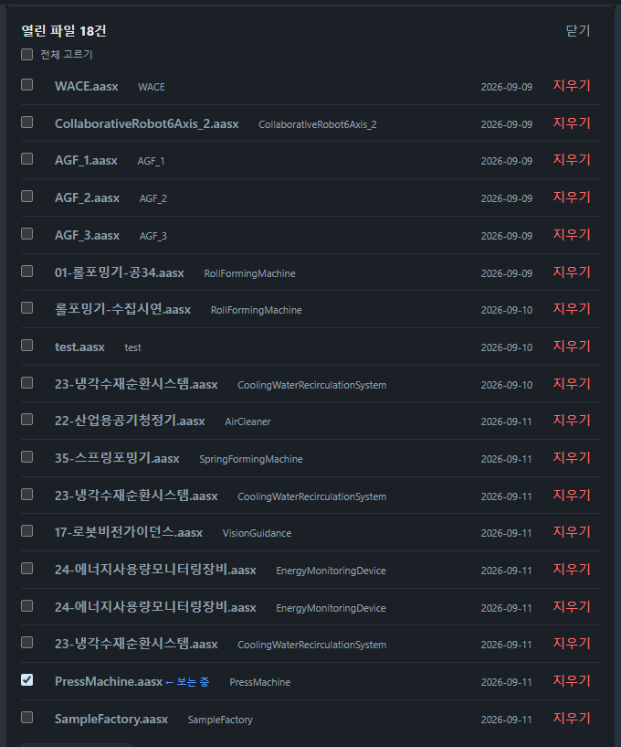

- 이름을 누르면 열립니다. 「← 보는 중」이 지금 파일
- 줄 끝 **「지우기」**로 하나씩, 여러 개는 이름 앞 **체크 박스** → 맨 아래 **「고른 N건 지우기」**(「전체 고르기」도 있음)
- 🔴 **지우면 되돌릴 수 없습니다.** 서버에 보관된 것이 사라집니다(내려받아 둔 `.aasx`는 남습니다)
- 지우려는 설비를 **가리키는 묶음이 있으면 먼저 알려 줍니다** — 묶음은 주소 하나로 설비를 가리킬 뿐이라 끊어져도 겉보기에 멀쩡하기 때문입니다. 묶음과 그 설비를 함께 지우는 것은 경고하지 않습니다

### 이어서 작업하기

올린 파일은 서버가 계속 들고 있고, 편집한 내용도 그때그때 서버에 저장됩니다. 브라우저를 껐다 켜도 그대로입니다 —
헤더 드롭다운이나 첫 화면의 「이어서 작업하기」에서 고르면 됩니다. **PC에서 다시 「AASX 열기」로 올리지 마십시오**(사본이 쌓입니다).

### 어디에 저장되나

| 띄운 방식 | 저장소 | 남나 |
|---|---|---|
| `node apps/api/dist/server.js` | 메모리 | ❌ 서버를 내리면 사라짐 |
| `AAS_DATA_DIR=<폴더> …` | 그 폴더의 파일 | ✅ 폴더를 복사하면 그대로 옮겨짐 |
| Docker (`docker compose`) | PostgreSQL(`pgdata` 볼륨) | ✅ `down -v`만 안 하면 남음 |

서로 다른 저장소는 서로 다른 목록입니다 — 이 PC에서 띄운 것과 사내 서버의 파일 목록은 다릅니다.
여러 파일을 한 꾸러미로 묶어 옮기는 기능은 없습니다 — 파일을 하나씩 내려받거나 저장소(폴더·볼륨)를 통째로 옮깁니다.

---

## 10. 규칙과 검증 결과서

### 「규칙과 규약」 화면 — 무슨 근거로 통과라고 하나

헤더 오른쪽 **설정 ▾ → 규칙과 규약 보기** — 이 도구가 지키는 것을 **지금 도는 그대로** 보여 줍니다(서버에서 받아 그리므로 문서와 코드가 어긋나면 이 화면이 먼저 드러냅니다).

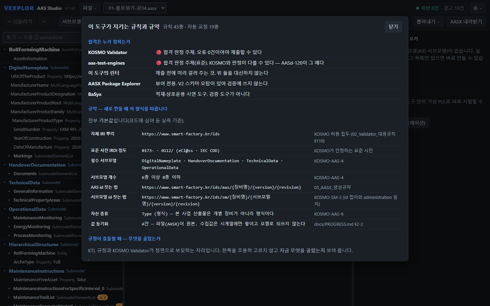

| 절 | 내용 |
|---|---|
| **합격은 누가 정하는가** | 🔴 이 도구가 정하지 않습니다. KOSMO Validator·aas-test-engines가 판정 주체 |
| **규약** | 자체 IRI 뿌리 · 필수 서브모델 · id 짓는 법 · 자산 종류(Type) · 값 동기화 방침 |
| **규정 충돌** | KTL 규정과 KOSMO가 부딪히는 자리에서 **지금 무엇을 골랐는지** |
| **규칙 43종** | id · 계층(L1·L2·L3) · 내용 · 근거 문서 · 자동 교정 여부 |

### 규정이 충돌할 때 — 정책으로 고릅니다

| 정책 | 기본값 | 바꾸면 |
|---|---|---|
| `iriConflict` | KOSMO 우선 | IDTA 공식 IRI를 보존하고 경고로만 |
| `smlChildIdShort` | 경고 | `forbid`면 위반 — BaSyx 적재·표준 검증 통과가 목표일 때 |
| `standardTemplateSemantics` | KOSMO 우선 | `preserve`면 IDTA·W3C 표준 용어를 교정 대상에서 뺌(AID 등 표준 템플릿을 넣었을 때) |

| 어떻게 | |
|---|---|
| 한 번만 | `…/lint?smlChildIdShort=forbid` — 그 요청만 다르게 판정 |
| 서버 전체 | 환경변수 `LINT_STANDARD_TERMS=preserve` |
| 재배포 없이 값 바꾸기 | **정책 파일** `AAS_POLICY_FILE=/etc/aas/policy.json` — `{"smlChildIdShort":"forbid","submodelCountRange":[6,9]}`. 🔴 틀린 값이면 서버가 뜨지 않습니다(조용히 무시하는 것보다 낫습니다). 「규칙」 화면 위에 "정책 파일로 바꾼 항목"이 뜹니다 |

우선순위: **질의 인자 > 환경변수 > 정책 파일 > 기본값**. 검사 **로직** 자체가 바뀌면(KOSMO 새 지적) 코드 수정입니다 — 규칙을 고친 뒤 `node scripts/make-rule-list.mjs`로 [규칙_목록.md](규칙_목록.md)를 다시 만듭니다.

> **AASd-120이 왜 경고인가** — 규격에는 있지만 KOSMO Validator는 검사하지 않습니다. 반면 `aas-test-engines`는 오류로,
> `basyx-python-sdk`는 요소를 **조용히 잃는 것**으로 처리합니다. 제출만이면 놔둬도 되지만 BaSyx에 올릴 계획이면 「자동 고치기」로 지우십시오(기본으로 함께 지웁니다).

---

## 11. 문서용 자료

헤더 **뽑아내기 ▾ → 문서용 자료** — 제출물 중 **가이던스**에 넣을 그림과 표를 뽑습니다(규정 §13: 모든 서브모델에 UML 다이어그램 첨부).

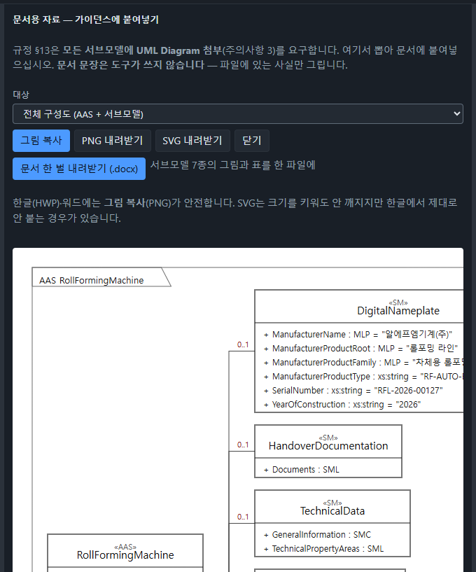

| 하고 싶은 것 | 방법 |
|---|---|
| 그림 하나 | 대상(전체 구성도 / 서브모델 하나) → **「그림 복사」** → 워드·한글에 Ctrl+V. 파일로는 「PNG 내려받기」 |
| 표 하나 | 서브모델을 고르면 그림 아래 표 → **「표 복사」**(표 모양 그대로 붙음) 또는 「CSV 내려받기」 |
| 한 벌 | **「문서 한 벌 내려받기 (.docx)」** — 서브모델 전부의 그림·표가 한 파일에. A4·여백 2cm·그림/표 번호가 이어집니다 |

- 한글(HWP)·워드에는 **「그림 복사」(PNG)**가 안전합니다. 그림은 흰 바탕입니다
- 표 서식은 실제 제출 가이던스가 쓰는 IDTA 표 서식 그대로. 표는 **장비 특화 요소(자체 IRI)를 담은 서브모델에만** 만들고, 표준 템플릿 서브모델은 표 대신 적을 정보와 「사람이 채울 자리」를 냅니다
- 🔴 도구는 **문장을 쓰지 않습니다.** 파일에 있는 사실만 뽑고 문서를 직접 고치지도 않습니다 — 붙여넣기용 자료입니다

---

## 12. 사내에 공유하기 — 계정 로그인과 API 키

쓰는 방법이 **둘**입니다. 사람은 **계정으로 로그인**하고, 기계(스크립트·MES·BaSyx 연동)는
**API 키**를 씁니다. 둘은 함께 켤 수 있고, 서로를 막지 않습니다.

### 12-1. 계정 로그인 (사람)

처음 한 번만 하면 됩니다.

1. 서버를 띄우고 브라우저로 접속합니다
2. 계정이 하나도 없으면 **「첫 관리자 만들기」** 화면이 뜹니다
   (로그인 화면이 안 보이면 **설정 → 첫 관리자 만들기**)
3. 로그인 이름·비밀번호(**10자 이상**)를 정합니다
4. 그다음부터 **설정 → 계정 관리**에서 사람을 더합니다

| 역할 | 할 수 있는 일 |
|---|---|
| 관리자(admin) | 전부 + 계정 만들기·잠그기·비밀번호 초기화 |
| 편집자(editor) | 파일을 열고 고치고 내보냅니다 |
| 열람자(viewer) | 보기만 — 고치려 하면 403 |

> 🔑 **설치 코드.** 서버를 **다른 사람도 닿는 주소로** 열어 두면, 첫 관리자를 만들 때
> 설치 코드를 묻습니다. 서버를 띄운 화면(기동 로그)에 찍혀 있습니다.
> 이것이 없으면 같은 망의 **아무나 먼저 눌러 관리자가 되고**, 정작 담당자는
> 「이미 계정이 있습니다」로 막힙니다. 값을 미리 정하려면 `AAS_SETUP_CODE=<값>`.
> 자기 PC에서만 열린 서버(혼자 쓰기)는 묻지 않습니다.

- 비밀번호는 **해시만** 저장합니다(원문은 어디에도 남지 않습니다)
- 5번 틀리면 5분 쉽니다 — 비밀번호를 대입하는 시도를 늦춥니다
- 8시간 안 쓰면 로그인이 풀립니다(최대 7일)
- 역할을 바꾸거나 계정을 잠그면 **그 사람의 로그인이 바로 끊깁니다**
- 🔴 계정이 하나라도 생기면 **API를 직접 부를 때도** 로그인(쿠키)이나 API 키가 있어야 합니다.
  2026-10-06 이전 판은 API 키를 정하지 않은 서버에서 로그인 없이 API로 읽고 지울 수 있었습니다(고쳤습니다).
  스크립트·사내 시스템이 이 서버를 부른다면 `AAS_TOKEN`을 정해 API 키로 부르십시오(12-2)
- 변경 이력에 **누가 고쳤는지** 함께 남습니다(5장 「이력」)

#### 서버를 껐다 켜면

| | 남는가 | 비고 |
|---|---|---|
| 계정·비밀번호·역할 | **남습니다** | 폴더 보관함은 `users.json`, Docker판은 DB에 |
| 올린 파일·고친 내용·이력 | **남습니다** | |
| 로그인 상태 | **풀립니다** | 서버 메모리에만 둡니다 — 다시 로그인하면 됩니다 |
| 화면의 ↶ 되돌리기 목록 | 비워집니다 | 이력(5장)에서 판을 골라 되돌릴 수는 있습니다 |

> 🔴 2026-10-06 이전 판의 **폴더 보관함**(`AAS_DATA_DIR`)은 계정을 파일에 남기지 않아,
> 껐다 켜면 계정이 사라지고 「첫 관리자 만들기」로 돌아갔습니다. 고쳤습니다 — 이전 판에서
> 만든 계정은 남아 있지 않으니 한 번만 다시 만드십시오.

#### 회원가입은 기본으로 닫혀 있습니다

사내 서버에서 아무나 계정을 만들면 안 되므로, 로그인 화면에는 **「회원가입」 대신
「관리자에게 요청하십시오」** 안내가 나옵니다. 사람은 관리자가 **설정 → 계정 관리**에서 더합니다.

| 이런 서버라면 | 설정 |
|---|---|
| 사내 팀 서버 (기본) | 아무것도 안 줍니다 — 관리자가 계정을 만들어 줍니다 |
| 누구나 가입해 쓰는 서버 | `AAS_SIGNUP=on` (+ `AAS_WORKSPACE=private` 권장 — 서로의 파일이 안 보이게) |
| 공개 체험 서버 | `DEMO_MODE=on` — 가입이 자동으로 열립니다([배포_호스팅.md](배포_호스팅.md)) |

가입한 사람은 **편집자**가 됩니다(`AAS_SIGNUP_ROLE=viewer`면 열람자). 🔴 관리자로는 가입되지
않습니다 — 가입 단추가 곧 관리자 발급 단추가 되기 때문입니다. 관리자로 올리는 것은 관리자가 합니다.

#### 같이 볼 것인가, 나눌 것인가 — 작업 공간

| | 기본 (팀 공용) | `AAS_WORKSPACE=private` |
|---|---|---|
| 보이는 파일 | **모두가 같은 파일**을 봅니다 | 저마다 **자기가 올린 것**만 봅니다 |
| 남의 파일 | 보이고, 역할에 따라 고칩니다 | 없는 것처럼 보입니다(주소를 알아도 404) |
| 관리자 · API 키 | 전부 | **전부** — 운영·기계 연동은 전체를 다룹니다 |
| 기동 때 올린 템플릿 | 누구나 읽고 고칩니다 | 누구나 읽기만(가져오기의 출처) |

한 팀이 같은 설비 파일을 같이 고치는 것이 보통이라 기본은 공용입니다. 서로 모르는 사람들이
같은 서버를 쓸 때만 나누십시오. 🔴 나누기를 켜기 **전에** 올려 둔 파일은 주인이 없어
모두에게 읽기 전용으로 보입니다 — 관리자가 정리해 주어야 합니다.

### 12-2. API 키 (기계)

사람이 아닌 호출 — 스크립트, 사내 시스템, Part 2 REST 연동입니다.

```bash
AAS_TOKEN=편집용-키 AAS_READONLY_TOKEN=검수용-키 node apps/api/dist/server.js   # Docker는 .env에
```

```bash
curl -H "Authorization: Bearer 편집용-키" http://서버:8080/packages
```

| | |
|---|---|
| 켜졌는지 | `curl localhost:8080/health` → `{"auth":"on"}` |
| 읽기 전용 키 | 보기만 됩니다. 고치려 하면 403 |
| 키도 계정도 없을 때 | 서버가 스스로 **그 PC에서만** 문을 엽니다(안전장치). 사내에 열려면 `AAS_ALLOW_OPEN=1` |

키는 영문·숫자·기호로 정하고 `Authorization: Bearer` 헤더로만 받습니다.

### 12-3. 🔴 HTTPS를 앞에 두십시오

**평문(http)으로 로그인하면 비밀번호와 로그인 쿠키가 그대로 지나갑니다.** 같은 망의
누구나 주워 담을 수 있습니다. 사내망이라도 사람이 로그인을 쓰기 시작하면 HTTPS를 두십시오.

가장 손쉬운 것은 Caddy입니다(인증서를 알아서 발급·갱신합니다).

```caddyfile
# Caddyfile — 같은 서버에서 8080으로 뜬 AAS 앞에 둔다
aas.사내도메인 {
    reverse_proxy 127.0.0.1:8080
}
```

```bash
caddy run --config Caddyfile
```

- 사내 도메인이라 공인 인증서를 못 받으면 `tls internal`(자체 서명)을 적고,
  사내 PC에 Caddy의 루트 인증서를 한 번 설치합니다
- 프로그램은 `X-Forwarded-Proto`를 보고 **HTTPS일 때만** 쿠키에 `Secure`를 붙이고
  HSTS를 말합니다. 평문 서버가 HSTS를 말하면 그 주소가 브라우저에서 영영
  https로만 열리게 굳기 때문입니다
- 프록시를 쓰면 API는 `127.0.0.1`에만 열어 두는 것이 안전합니다(`AAS_HOST=127.0.0.1`)

### 12-4. 아무 설정 없이 띄우면 「혼자 쓰기」입니다

계정도 API 키도 없이 띄운 서버는 자기 PC에서만 열립니다(127.0.0.1). 로그인 화면이 없고,
변경 이력의 「누가」도 비어 있습니다 — 혼자 쓰는 자리에서 물을 것이 아니기 때문입니다.
여럿이 쓰려면 Docker로 서버에 올리십시오(1장).

---

## 13. 문제가 생기면

| 증상 | 원인과 대처 |
|---|---|
| 화면은 뜨는데 파일 목록이 비어 있다 / 「API 서버에 연결할 수 없습니다 — 8080…」 | API가 안 떠 있습니다. `npm run dev:api` 먼저 |
| 첫 화면에 `Unexpected token '<'…` | 개발 서버(5173)가 API 경로를 못 넘기고 있습니다 — `apps/web/vite.config.ts`의 `API_PATHS`. 배포판(한 포트)에서는 나지 않습니다 |
| 사내 서버 주소가 안 열린다 | 그 PC의 Docker Desktop이 내려간 것. 실행 후 `docker compose up -d`. 자료(pgdata)는 그대로 |
| 올렸는데 400 | AASX가 아니거나 깨진 ZIP |
| 413 | 파일이 상한을 넘었습니다. `AASX_MAX_TOTAL_MB` |
| "다른 곳에서 먼저 바뀌었습니다" | 다른 사람이 먼저 고쳤습니다. 「다시 읽기」 |
| 서버를 껐더니 파일이 사라졌다 | 저장소가 메모리였습니다(9장). `AAS_DATA_DIR` 또는 Docker |
| 새로 만들기 폼이 사라진다 | 첫 화면에서 파일을 올리는 동안 폼이 사라지던 결함은 2026-09-09에 고쳤습니다. 최신 판인지 확인 |
| 「수집」이 501 | `COLLECT=on`으로 띄우지 않았습니다 |
| 「설비에서 불러오기」가 "이 주소는 … 저작도구입니다"로 막힌다 | 내주는 주소를 넣었습니다. 설비(PLC) 주소를 넣으십시오 |
| 수집이 「접속 실패」 | 주소·방화벽. 가상 PLC로 시험 중이면 `node scripts/plc-simulator.mjs`가 떠 있는지 |
| 「→ 내주는 중」 칩이 없다 | `OPCUA_SERVER=on`이 아닙니다 |
| 다른 PC에서 OPC UA로 못 붙는다 | `OPCUA_HOST`에 이 기계의 IP, 방화벽에서 그 포트 |
| 「접근 토큰이 필요합니다」 / 넣었는데 또 묻는다 | 서버가 인증을 켰습니다 / 토큰이 글자 하나까지 같아야 합니다 |
| 로그인 화면이 안 뜬다 | 계정도 API 키도 없는 서버입니다 — 아무나 들어옵니다. **설정 → 첫 관리자 만들기**로 시작하십시오(12-1) |
| 「설치 코드가 필요합니다」 | 밖으로 열린 서버라 첫 관리자 선점을 막고 있습니다. 서버 기동 로그의 `🔑 첫 관리자 설치 코드`를 넣으십시오 |
| 「이미 계정이 있습니다」인데 내 계정이 없다 | 누군가 먼저 만들었습니다. 그 사람에게 받거나, 설치 코드를 켠 뒤 저장소를 비우고 다시 시작하십시오 |
| 「다른 사이트에서 보낸 요청은 받지 않습니다」 | 즐겨찾기·링크가 아니라 **브라우저 주소창의 서버 주소**로 직접 들어가십시오 |
| 로그인이 자꾸 풀린다 | 8시간 안 쓰면 풀립니다(최대 7일). 서버를 다시 띄워도 풀립니다 — 로그인 정보는 서버 메모리에 있습니다 |
| 5번 틀린 뒤 "잠시 뒤에" | 비밀번호 대입을 늦추는 장치입니다. 5분 기다리십시오 |
| `docker compose up`이 비밀번호 오류 | `.env`의 `POSTGRES_PASSWORD`가 비어 있습니다 |
| 포트 8080이 이미 쓰인다 | `.env`의 `APP_PORT` |

---

## 14. 알아 둘 한계

- **인증은 켜야 걸립니다.** 아무 설정 없이 띄우면 주소를 아는 사람은 누구나 접근·삭제할 수 있습니다(12장).
  계정을 만들지 않은 채 밖으로 열어 두면 **아무나 먼저 관리자가 될 수 있어** 설치 코드로 막아 두었습니다(12-1)
- **OPC UA 내주는 포트에는 인증이 없습니다**(8-6절). 사내망 안에서만
- XML 형식은 읽기만 됩니다. 저장은 언제나 JSON
- 되돌리기 목록은 서버가 살아 있는 동안만. 이력은 남습니다
- 되돌리기는 **사람을 구분하지 않습니다** — 여럿이 쓰면 남의 변경도 되돌아갑니다.
  다만 **누가 했는지는 남습니다**(로그인을 쓰는 서버에서). 이력 칸과 되돌리기 목록에 이름이 붙습니다
- Operation(조작) 요소는 다루지 않습니다
- 최종 합격 판정은 **KOSMO Validator**가 합니다. 이 도구는 제출 전에 걸러 주는 역할입니다

---

## 부록 A. 자주 만나는 지적과 대처

| 규칙 | 뜻 | 대처 |
|---|---|---|
| `KOSMO-SME-3` | semanticId가 없거나 대응 CD가 없음 | 「자동 고치기」가 규약대로 만들어 줍니다. **가장 흔한 지적** |
| `KOSMO-SM-2` / `AAS-3` | id 끝 두 자리가 `administration`과 다름 | 「자동 고치기」(참조까지 함께 갱신) |
| `KOSMO-SM-3` | semanticId가 허용 목록 밖(보통 IDTA 공식 IRI) | 「자동 고치기」가 자기 id로 옮기고 이관 대장에 원본을 남깁니다 |
| `KOSMO-AAS-1` | 썸네일 없음 | 「자동 고치기」 |
| `KOSMO-AAS-4` | 서브모델 수가 6~8종 밖 | 넣고 빼서 맞춥니다 |
| `KOSMO-AAS-6` / `SM-4` | `assetKind=Type` / `kind=Template`이 아님 | 「자동 고치기」 |
| `KOSMO-SME-4` | Property 값이 비어 있음 | **사람이 입력**(예시 데이터) |
| `KOSMO-CD-3` | 영문 정의 없음 | **사람이 입력**(개발계획서 원문 인용, 창작 금지) — 4-7 |
| `KOSMO-CD-5` (참고) | 같은 idShort의 CD가 표준 사전 2곳에 있음 | 고치지 마십시오 — 사실 전달 |
| `AASd-120` (경고) | 리스트 자식에 idShort가 있음 | 「자동 고치기」가 함께 지웁니다. BaSyx·표준 검증기가 거부하는 항목 |
| `HIER-1·2·3` | 묶음 파일의 끈이 끊어짐 | 7-6 |

## 부록 B. 용어 한눈에

| 용어 | 뜻 |
|---|---|
| **AAS** (AssetAdministrationShell) | 자산(설비·공정) 하나의 디지털 껍데기. 파일(.aasx) 하나 = AAS 하나 |
| **AssetInformation** | 이 AAS가 어떤 자산인지 — `assetKind`(Type/Instance) · `globalAssetId`(주소) · 대표 사진 |
| **Submodel** (서브모델) | 내용의 장(章) — 명판(DigitalNameplate) · 기술사양(TechnicalData) · 문서(HandoverDocumentation) … |
| **SMC / SML** | SubmodelElementCollection(이름으로 담는 묶음) / SubmodelElementList(순서로 담는 목록) |
| **Property · MLP · Range · File** | 값 하나 · 언어별 글 · 최소~최대 · 첨부 파일 |
| **idShort** | 요소의 이름(영문). 같은 자리에서 유일해야 합니다 |
| **semanticId** | 이 요소가 "무엇을 뜻하는지" 가리키는 주소 — 표준 사전(IRDI, `0173-1#02-…`) 또는 자체 IRI |
| **ConceptDescription (CD)** | semanticId가 가리키는 뜻풀이(영문 정의·자료형·단위) |
| **HierarchicalStructures** | 구성(BoM·공정 구성)을 적는 표준 서브모델(IDTA 02011). 설비에는 부품, 회사에는 공정·설비 |
| **AID** (AssetInterfacesDescription) | 어디에 접속해 무엇을 읽을지 적는 표준 서브모델(IDTA 02017) — 수집 연결 |
| **Type / Instance** | 형식(카탈로그) / 개체(일련번호 있는 한 대). 이 사업 산출물은 **Type** |
| **KOSMO Validator** | 제출처의 검사기 — **합격 판정 주체**. 이 도구의 린터는 그 전에 걸러 주는 것 |
